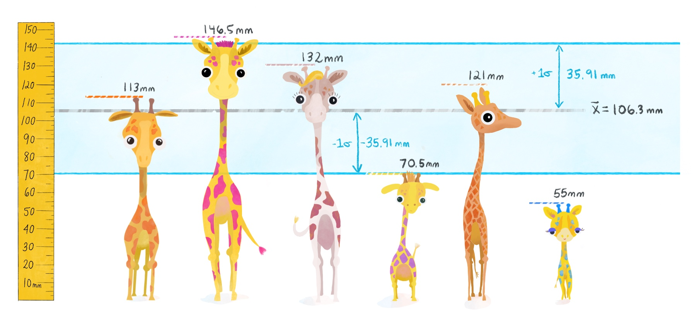
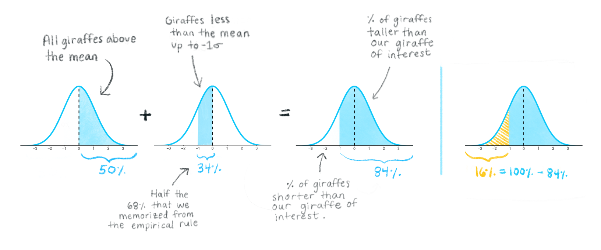

:::obj

**Module learning objectives**

1. Describe the steps for constructing the sum of squares
1. Describe how the standard deviations can allow us to determine which data values are common or rare 
1. Write a function for the variance and standard deviation
1. Explain why the sample variance would be downwardly biased if we did not correct it by diving by (n-1)

:::


```{r setup, include=FALSE}
knitr::opts_chunk$set(echo = TRUE, fig.align = "center")
```


# Measures of spread
After successfully computing the mean, you return to the memory of the first day you had collected data. There was one teacup giraffe that was your favorite-- it was relatively small with purple spots and perky tail! You begin to wonder how rare it would be to encounter a giraffe smaller than this one. To answer this question, you need to be able to calculate a **measure of spread**. 

<center>{width=600px}</center>

You might start by quantifying the simplest measure of spread, the **range**. This at least tells us the boundaries within which all the sample heights fall, but the range ignores important contextual information. For example, two data sets can have very different spreads but still have the same range.

<center>{width=600px}</center>

If we want to avoid undue influence of outliers for the measure of spread, the range is not good enough to provide us with a wholistic, robust measure.

What is a more stable measurement? The answer is the **variance**.

# Variance in plain language
You need a solid understanding of variance in order to grasp the mechanics of any statistical test. But what does the concept variance really capture?

  * Recall the normal distribution: when we inspect the distributions below visually, we see that they all have the same mean, but some distributions are more spread out. Bell curves that are more "squished together" are composed of observations that are more similar to one another, while bell curves that are more "spread out" are composed of observations that have greater variability. Wider bell-curves mean greater variance! In plain language, the variance gives us an idea of how similar observations are to one another, and to the average value. 
  
  

# How to calculate variance
Let's begin by going through the steps and equations for calculating the variance of a *population*. We'll explain how to modify this for calculating the *sample* variance later on.

First, the idea is to capture how far away individual observations lie from the mean. In other words, we could subtract the mean from each observation. This is called the **deviation** from the mean. And since we're calculating a *population* variance, we will use $\mu$ for the mean instead of ${\bar{x}}$. 

Calculating the deviations is a great start, but we're back to the problem of needing to summarize multiple values. Since these newly calculated values are both negative and positive, we quickly realize that adding them up (like the first step when calculating the mean) would not be a productive idea since the negatives cancel the positives.

What's the easiest thing to do when you want to retain how far away a point is from the mean irrespective of whether it's above or below the mean? How about taking the absolute value?

Though the absolute value of the deviation would be a valid measure of distance from the mean, it turns out that it has some mathematical properties that don't make it the best choice, especially for more complex statistial analyses involving the variance later down the line. 

# Why we square the deviations
There is an alternative with simpler, "better behaved" mathematical properties: **squaring the deviations**. Squaring will always give us positive values, so the values can never cancel each other out. It's worth pointing out, however, that a consequence of squaring deviations will tend to amplify the influence of values at extreme distances from the mean. You can read [this thread](https://stats.stackexchange.com/questions/118/why-square-the-difference-instead-of-taking-the-absolute-value-in-standard-devia) for a more detailed discussion about absolute values versus squared deviations. 

# Sum of squares
Now we have positive, squared deviation values that can be summed to a single total. We call this total **the sum of squares**, and the equation is shown below. 

<div style="margin-bottom:50px">
</div>
\begin{equation}
 (\#eq:equation1)
 \Large {\sum_{i=1}^N (x_i - \mu)^2}
 \end{equation}
<div style="margin-bottom:50px">
</div>

The sum of squares is an important calculation that we will see again for other statistical operations. The animation below illustrates how these sums of squares are "constructed" starting with the sample observations and then squaring each one's distance away from the mean.  

```{r fig.show="animate", animation.hook = 'gifski', fig.width=7.2, fig.height=4.8, echo=FALSE, message=FALSE, warning=FALSE, results = 'hide', interval=0.01666667, fig.align='center', cache = TRUE}
library(ggplot2)
s <- data.frame(x=c(113, 146.5, 132, 70.5, 121, 55), y=c(8.75,1.25,3.75,3.75,6.25,1.25))
s <- s[order(s$x),]
s <- s[c(1,2,3,6,5,4),]
s2 <- s
s <- s[c(1,2,6,5,4,3),]
m <- mean(s[,1])
m2 <- 85
lim <- c(0, 60)
d <- data.frame(x1=s[,1], x2=rep(m, 6), y1=s$y, y2=(abs(s[,1]-m))+s$y)
co <- c("#6FB4CE", "#D97FDA", "#DC5F24", "#C46A79", "#f93188", "#F88336")

v <- do.call(cbind, lapply(1:6, function(x) seq(d[x,]$x1, d[x,]$x2, by = (d[x,]$x2-d[x,]$x1)/29)))
vv <- lapply(1:30, function(y) data.frame(x1=v[y,], x2=d$x1, y1=s$y, y2=(abs(s[,1]-m))+s$y))

pp <- function(x){
  p1 <- ggplot()+geom_point(data=s, aes(x=x, y=y),color=co, size=4)+
    theme_light()+ylim(lim)+geom_segment(aes(x = x2, y = y1, xend = x1, yend = y1), data = x, color=co, size=2)+labs(x="Teacup giraffe height", y=NULL)+theme(panel.border=element_blank(),panel.grid.minor=element_blank(), axis.ticks=element_blank())+
    geom_segment(aes(x=m, xend=m, y=0, yend=lim[2]), linetype="dashed", color="black", size=2)+
    annotate('text', x = 111.33, y = 53, label = "bar(x)",parse = TRUE,size=15)
  p1
}

lapply(vv, function(x) pp(x))

h <- do.call(cbind, lapply(1:6, function(x) seq(d[x,]$y1, d[x,]$y2, by = (d[x,]$y2-d[x,]$y1)/29)))
hh <- lapply(1:30, function(y) data.frame(x1=s[,1], x2=rep(m, 6), y1=s$y, y2=h[y,]))

pp2 <- function(x){
  p2 <- ggplot()+geom_point(data=s, aes(x=x, y=y),color=co, size=4)+
    theme_light()+ylim(lim)+geom_segment(aes(x = x1, y = y1, xend = x2, yend = y1), data = d, color=co, size=2)+
  geom_segment(aes(x = x1, y = y2, xend = x1, yend = y1), data = x, color=co, size=2)+labs(x="Teacup giraffe height", y=NULL)+theme(panel.border=element_blank(),panel.grid.minor=element_blank(), axis.ticks=element_blank())+
    geom_segment(aes(x=m, xend=m, y=0, yend=lim[2]), linetype="dashed", color="black", size=2)+
    annotate('text', x = 111.33, y = 53, label = "bar(x)",parse = TRUE,size=15)
p2
}

lapply(hh, function(x) pp2(x))

pp22 <- function(x){
  p2 <- ggplot()+theme_light()+geom_rect(data=d, mapping=aes(xmin=x1, xmax=x2, ymin=y1, ymax=y2), color=alpha(co, x),fill=co, alpha=x/5, size=2)+ylim(lim)+geom_segment(aes(x = x1, y = y1, xend = x2, yend = y1), data = d, color=co, size=2)+
  geom_segment(aes(x = x1, y = y2, xend = x1, yend = y1), data = d, color=co, size=2)+
    geom_point(data=s, aes(x=x, y=y),color=co, size=4)+
    labs(x="Teacup giraffe height", y=NULL)+theme(panel.border=element_blank(),panel.grid.minor=element_blank(), axis.ticks=element_blank())+
    geom_segment(aes(x=m, xend=m, y=0, yend=lim[2]), linetype="dashed", color="black", size=2)+
    annotate('text', x = 111.33, y = 53, label = "bar(x)",parse = TRUE,size=15)
p2
}
lapply(seq(0,1,0.1), function(x) pp22(x))

pp3 <- function(x){
p3 <- ggplot()+theme_light()+geom_rect(data=d, mapping=aes(xmin=x1, xmax=x2, ymin=y1, ymax=y2), color=co,fill=co, alpha=0.2, size=2)+
  geom_point(data=s, aes(x=x, y=y), color=co, size=4)+
  ylim(lim)+labs(x="Teacup giraffe height", y=NULL)+theme(panel.border=element_blank(),panel.grid.minor=element_blank(), axis.ticks=element_blank())+
    geom_segment(aes(x=m, xend=m, y=0, yend=lim[2]), linetype="dashed", color="black", size=2)+
    annotate('text', x = 111.33, y = 53, label = "bar(x)",parse = TRUE,size=15)
p3
}
lapply(1:15, function(x) pp3())

```

Once the squares have been "constructed", we sum their squares, producing a single value.


# Variance, $\sigma^2$
We need to take into account how many observations contributed to these sum of squares. So, we divide the sum of squares by N. This step essentially takes the average of the squared differences from the mean. This is the variance.


<div style="margin-bottom:50px">
</div>
\begin{equation}
 (\#eq:equation2)
 \Large \sigma^2 = \frac{\sum_{i=1}^N (x_i - \mu)^2}{N}
 \end{equation}
<div style="margin-bottom:50px">
</div>

# Standard Deviation, $\sigma$
The problem with variance is that its value is not easily interpretable, the units will be squared and therefore not on the same scale as the mean. It would not be very intuitive to interpret giraffe heights written in *millimeters squared*! The **standard deviation** fixes that. We "un-square" the variance, and now we return to the data's original units (millimeters). The standard deviation equation is below:

<div style="margin-bottom:50px">
</div>
\begin{equation}
 (\#eq:equation3)
 \Large \sigma = \sqrt{\frac{\sum_{i=1}^N (x_i - \mu)^2}{N}}
 \end{equation}
<div style="margin-bottom:50px"></div>

# Population vs sample equations
One more thing: the equations above are for calculating the variance and standard deviation of a population. In real life applications, the population equations will almost never be used during data analysis. To calculate the variance and standard deviation for a sample instead, we will need to divide by n-1 instead of N, which we explain at the end of this module. Note that we also change to the corresponding symbols for the sample mean ($\bar{x}$),  sample size (lowercase $n$), and use a lowercase $s$ in place of $\sigma$. 

When we apply this change, our equation for the **sample variance, $s^2$ ** is:

<div style="margin-bottom:50px">
</div>
\begin{equation}
 (\#eq:equation4)
 \Large s^2 = \frac{\sum_{i=1}^n (x_i - \bar{x})^2}{n-1}
 \end{equation}
<div style="margin-bottom:50px"></div>

And for **sample standard deviation, $s$**:

<div style="margin-bottom:50px">
</div>
\begin{equation}
 (\#eq:equation5)
 \Large s = \sqrt{\frac{\sum_{i=1}^n (x_i - \bar{x})^2}{n-1}}
 \end{equation}
<div style="margin-bottom:50px"></div>

# Meaning of the standard deviation
Since we're now focusing on samples, let's think about how we can apply the standard deviation in a useful way to normal distributions to predict how "rare" or "common" particular observations in a data set may be. For the normal distribution, almost all of the data will fall within ± 3 standard deviations from the mean. This rule of thumb, called the **empirical rule**, is illustrated below and you can [(read more about it here)](https://newonlinecourses.science.psu.edu/stat200/lesson/2/2.2/2.2.7).
<a name="empirical">

</a>

  * The entire normal distribution includes 100% of the data. The empirical rule states that the interval created by **1 standard deviation above and below the mean includes 68% of all the data**. Observations within these bounds would be fairly common, but it would not be exceedingly rare to observe data that fall *outside* of these bounds. 
  
  * **2 standard deviations above and below the mean** encompasses approximately **95%** of the data. Observations that fall within these bounds include the common and also infrequent observations. Observations that fall *outside* of 2 standard deviations would be uncommon.
  
  * **3 standard deviations above and below the mean** encompass **99.7%** of the data, capturing almost all possible observations in the set. Observations that fall oustide of these bounds into the extremes of distribution's tails would be exceedingly rare to observe (but still possible if you sample large enough groups to detect these rare events!).
  
  
# Example

Let's calculate the variance and standard deviation using 6 observations of giraffe heights from a subset of our data, including your favorite small one with the purple spots.

(1) **Calculate the sample mean**, $\bar{x}$:

```{r}
h <- c(113, 146.5, 132, 70.5, 121, 55) 
mean(h)
```


We'll plot the mean $\bar{x}$ below with a gray line. 


 (2) **Find the deviation** from the mean, the difference between each giraffe's height and $\bar{x}$.
 
```{r}
deviation <- h - mean(h)
deviation
```
 
 
 
 (3) **Calculate Variance**: Square the deviations, add them all up to get the sum of squares, and then take the average of the sum of squares (adjusted to "n-1" because we're using a sample).
```{r}
SS <- sum(deviation^2)
variance <-  SS/(length(h)-1) # Divides by N-1
variance
```
(4) **Standard Deviation**: Take the square root of the variance.

```{r}
sqrt(variance)
```

Because the standard devation is a standardized score-- we can now focus on particular giraffes and see whether or not they lie within 1 standard deviation of the mean. 



We see the little blue spotted giraffe is more than 1 standard deviation below the mean-- and so we can conclude that a little guy of his height is rather short-- even smaller than your favorite! Similarly, the giraffe with bright pink spots is taller than 1 standard deviation above the mean-- quite tall!

# Standard deviation application example
Using the standard deviation and the empirical rule described earlier, we now finally have the tools to answer our original question from the start of the module: how probable it is to find a giraffe smaller than our favorite purple-spotted one?

  * Our giraffe of interest happens to be almost exactly 1 standard deviation below the mean, so this makes it easy to assess the probability of encountering a giraffe shorter than him.

  * If we assume our sample comes from a normally distributed population, then **what percentage of giraffes will be shorter than the one with purple spots?**
  
   
  
We can apply the knowledge that the full percentage area under the curve is 100%, and what we know from the empirical rule, to conclude that there is approximately 16% of giraffes will be shorter than the one with purple spots. So, it would be common to find giraffes taller than our favorite but somewhat of a treat to find ones smaller--like the blue one!

Maybe this explains why the little blue spotted giraffe is so cute--- it is not so common to find ones so small!

# Code it up
Using \@ref(eq:equation4) and \@ref(eq:equation5), it's easy to translate the equations for the variance and standard deviation into code in R. 
  
  * In the window below, you will write two separate functions, one to calculate the sample variance and another to calculate the sample standard deviation. Name your functions `my_variance` and `my_sd`. 
  
  * Test your functions on the vector `heights_island1` and compare the output of your "handwritten" functions with the base R function of `var( )` and `sd( )`. 
  
<!---LEARNR EX 1-->

<iframe class="interactive" id="myIframe1" src="https://tinystats.shinyapps.io/04-variance-ex1/" scrolling="no" frameborder="no"></iframe>

<!------------->

<div style="margin-top:50px"></div>
<center>{width=650px}</center>
  
# Population vs Sample ($N$ vs $n-1$)
We have to correct the calculated variance by dividing by $n-1$. Let's explain why:

  * Let's recall that when we calculate the sum of squares, we only have the sample mean $\bar{x}$ to go off of as our center point. 
  
  <center>{width=500px}</center>

  * We must first acknowledge that while the population $\mu$ is unknowable, the chance that the sample $\bar{x}$ and the population $\mu$ are the same is unlikely.
    + It's also worth pointing out that the risk that $\bar{x}$ and $\mu$ are not even values close to each other is much increased when $\bar{x}$ has been calculated from a small sample. 
    
  * Recognizing that the true population mean value is probably some *other* value than $\bar{x}$, let's recalculate the sum of squares. This time we will use an imaginary true population $\mu$ as our center point, which in the animation below will be represented with a line at an arbitrary distance away from $\bar{x}$.

```{r fig.show="animate", animation.hook = 'gifski', fig.width=5.04, fig.height=7, echo=FALSE, message=FALSE, warning=FALSE, results = 'hide', interval=0.01666667, fig.align = 'center', cache=TRUE}
library(ggplot2)
s <- data.frame(x=c(113, 146.5, 132, 70.5, 121, 55), y=c(9,1.5,4,4,6.5,1.5))
s <- s[order(s$x),]
s <- s[c(1,2,3,6,5,4),]
s2 <- s
s <- s[c(1,2,6,5,4,3),]
m <- mean(s[,1])
m2 <- 85
lim <- c(-73, 60)
d <- data.frame(x1=s[,1], x2=rep(m, 6), y1=s$y, y2=(abs(s[,1]-m))+s$y)
co <- c("#6FB4CE", "#D97FDA", "#DC5F24", "#C46A79", "#f93188", "#F88336")
co2 <- c("grey30", "grey40", "grey80", "grey70", "grey60", "grey50")


s2$y <- (s2$y)*-1
s2[3,2] <- -9
s2 <- s2[c(1,2,4:6,3),]
d2 <- data.frame(x1=s2[,1], x2=rep(m2, 6), y1=s2$y, y2=(-abs(s2[,1]-m2))+s2$y)

v <- do.call(cbind, lapply(1:6, function(x) seq(d[x,]$x1, d[x,]$x2, by = (d[x,]$x2-d[x,]$x1)/29)))
vv <- lapply(1:30, function(y) data.frame(x1=v[y,], x2=d$x1, y1=s$y, y2=(abs(s[,1]-m))+s$y))

v2 <- do.call(cbind, lapply(1:6, function(x) seq(d2[x,]$x1, d2[x,]$x2, by = (d2[x,]$x2-d2[x,]$x1)/29)))
vv2 <- lapply(1:30, function(y) data.frame(x1.2=v2[y,], x2.2=d2$x1, y1.2=s2$y, y2.2=(abs(s2[,1]-m2))+s2$y))

vv <- lapply(1:30, function(x) cbind(vv[[x]], vv2[[x]]))

pp <- function(x){
  p1 <- ggplot()+geom_point(data=s, aes(x=x, y=y),color=co, size=3)+geom_point(data=s2, aes(x=x, y=y),color=co2, size=3)+theme_light()+ylim(lim)+geom_segment(aes(x = x2, y = y1, xend = x1, yend = y1), data = x, color=co, size=1.5)+geom_segment(aes(x = x2.2, y = y1.2, xend = x1.2, yend = y1.2), data = x, color=co2, size=1.5)+labs(x="Teacup giraffe heights", y=NULL)+theme(panel.border=element_blank(),panel.grid.minor=element_blank(), axis.ticks=element_blank())+
    geom_segment(aes(x=m, xend=m, y=0, yend=lim[2]), linetype="dashed", color="black", size=1.5)+
    geom_segment(aes(x=m2, xend=m2, y=0, yend=lim[1]), linetype="solid", color="black", size=1.5)+
    annotate('text', x = 80, y = -60, label = "mu",parse = TRUE,size=12)+
    annotate('text', x = 111.33, y = 53, label = "bar(x)",parse = TRUE,size=12)
  p1
}

lapply(vv, function(x) pp(x))

h <- do.call(cbind, lapply(1:6, function(x) seq(d[x,]$y1, d[x,]$y2, by = (d[x,]$y2-d[x,]$y1)/29)))
hh <- lapply(1:30, function(y) data.frame(x1=s[,1], x2=rep(m, 6), y1=s$y, y2=h[y,]))

h2 <- do.call(cbind, lapply(1:6, function(x) seq(d2[x,]$y1, d2[x,]$y2, by = (d2[x,]$y2-d2[x,]$y1)/29)))
hh2 <- lapply(1:30, function(y) data.frame(x1.2=s2[,1], x2.2=rep(m2, 6), y1.2=s2$y, y2.2=h2[y,]))

hh <- lapply(1:30, function(x) cbind(hh[[x]], hh2[[x]]))

pp2 <- function(x){
  p2 <- ggplot()+geom_point(data=s, aes(x=x, y=y),color=co, size=3)+geom_point(data=s2, aes(x=x, y=y),color=co2, size=3)+theme_light()+ylim(lim)+geom_segment(aes(x = x1, y = y1, xend = x2, yend = y1), data = d, color=co, size=1.5)+geom_segment(aes(x = x1, y = y1, xend = x2, yend = y1), data = d2, color=co2, size=1.5)+
  geom_segment(aes(x = x1.2, y = y2.2, xend = x1.2, yend = y1.2), data = x, color=co2, size=1.5)+geom_segment(aes(x = x1, y = y2, xend = x1, yend = y1), data = x, color=co, size=1.5)+labs(x="Teacup giraffe heights", y=NULL)+theme(panel.border=element_blank(),panel.grid.minor=element_blank(), axis.ticks=element_blank())+
    geom_segment(aes(x=m, xend=m, y=0, yend=lim[2]), linetype="dashed", color="black", size=1.5)+
    geom_segment(aes(x=m2, xend=m2, y=0, yend=lim[1]), linetype="solid", color="black", size=1.5)+
    annotate('text', x = 80, y = -60, label = "mu",parse = TRUE,size=12)+
    annotate('text', x = 111.33, y = 53, label = "bar(x)",parse = TRUE,size=12)
p2
}

lapply(hh, function(x) pp2(x))

pp22 <- function(x){
  p2 <- ggplot()+theme_light()+geom_rect(data=d, mapping=aes(xmin=x1, xmax=x2, ymin=y1, ymax=y2), color=alpha(co, x),fill=co, alpha=x/5, size=1.5)+geom_rect(data=d2, mapping=aes(xmin=x1, xmax=x2, ymin=y1, ymax=y2), color=alpha(co2, x),fill=co2, alpha=x/5, size=1.5)+ylim(lim)+geom_segment(aes(x = x1, y = y1, xend = x2, yend = y1), data = d, color=co, size=1.5)+geom_segment(aes(x = x1, y = y1, xend = x2, yend = y1), data = d2, color=co2, size=1.5)+
  geom_segment(aes(x = x1, y = y2, xend = x1, yend = y1), data = d, color=co, size=1.5)+geom_segment(aes(x = x1, y = y2, xend = x1, yend = y1), data = d2, color=co2, size=2)+geom_point(data=s, aes(x=x, y=y),color=co, size=3)+geom_point(data=s2, aes(x=x, y=y),color=co2, size=3)+
    labs(x="Teacup giraffe heights", y=NULL)+theme(panel.border=element_blank(),panel.grid.minor=element_blank(), axis.ticks=element_blank())+
    geom_segment(aes(x=m, xend=m, y=0, yend=lim[2]), linetype="dashed", color="black", size=1.5)+
    geom_segment(aes(x=m2, xend=m2, y=0, yend=lim[1]), linetype="solid", color="black", size=1.5)+
    annotate('text', x = 80, y = -60, label = "mu",parse = TRUE,size=12)+
    annotate('text', x = 111.33, y = 53, label = "bar(x)",parse = TRUE,size=12)
p2
}
lapply(seq(0,1,0.1), function(x) pp22(x))

pp3 <- function(x){
p3 <- ggplot()+theme_light()+geom_rect(data=d, mapping=aes(xmin=x1, xmax=x2, ymin=y1, ymax=y2), color=co,fill=co, alpha=0.2, size=1.5)+geom_rect(data=d2, mapping=aes(xmin=x1, xmax=x2, ymin=y1, ymax=y2), color=co2,fill=co2, alpha=0.2, size=1.5)+geom_point(data=s, aes(x=x, y=y), color=co, size=3)+geom_point(data=s2, aes(x=x, y=y), color=co2, size=3)+ylim(lim)+labs(x="Teacup giraffe heights", y=NULL)+theme(panel.border=element_blank(),panel.grid.minor=element_blank(), axis.ticks=element_blank())+
    geom_segment(aes(x=m, xend=m, y=0, yend=lim[2]), linetype="dashed", color="black", size=1.5)+
    geom_segment(aes(x=m2, xend=m2, y=0, yend=lim[1]), linetype="solid", color="black", size=1.5)+
    annotate('text', x = 80, y = -60, label = "mu",parse = TRUE,size=12)+
    annotate('text', x = 111.33, y = 53, label = "bar(x)",parse = TRUE,size=12)
p3
}
lapply(1:15, function(x) pp3())

```
 
  * When we compare the sum of squares in both of these scenarios: 1) using $\bar{x}$ or 2) using our imaginary $\mu$, we see that the sum of squares from $\mu$ will *always* be greater than the $\bar{x}$ sum of squares. This is true because by definition of being the sample mean, the line at $\bar{x}$ will always be the "center" of the values in our sample. Its location already minimizes the total distance of all the observations to the center. A line at any other location (i.e. $\mu$) would be a line that is not mimimizing the distance for observations in our sample.
  
<center>{width=750px}</center>

  * Therefore, when we calculate the sum of squares (and consequently, the variance and the standard deviation) using the sample mean $\bar{x}$, we are most likely arriving at a value that is downwardly biased compared to what the true variance or standard deviation would be if we were able to know and use the population mean $\mu$. 
  
  * This is why we need to adjust our sample variance by diving by $n-1$ instead of just $N$. By diving by a smaller value (i.e. $n-1$ instead of N), we ensure that the overall value of the variance and standard deviation will be a little larger, correcting for the downward bias we just described. 
  
# Things to think about
**How badly might the sample variance be downwardly biased?**: Well, it depends on how far away $\bar{x}$ is from the true $\mu$. The further away it is, the worse the downward bias will be!
  
  * Of course, we want to avoid having a very downwardly biased variance. What controls how far away $\bar{x}$ is from $\mu$? The sample size! As pointed out previously, the larger the sample, the greater the likelihood that your sample mean will resemble the population mean. 
  
  * Press Play on the animation below. The plot shows the relationship between bias in the variance, the sample size, and the distance between $\bar{x}$ and $\mu$. Each dot represents one out of a thousand random samples all from the same population. The vertical dotted line represents $\mu$, and the horizontal dotted line represents the true population variance (animation inspired by Khan Academy [video](https://www.khanacademy.org/math/ap-statistics/summarizing-quantitative-data-ap/more-standard-deviation/v/simulation-showing-bias-in-sample-variance).)

```{r, tut=FALSE, echo=FALSE, message= FALSE, warning=FALSE, cache=TRUE}
library(ggplot2)
library(plotly)
library(here)

set.seed(12)
d <- rnorm(50, 10, 2)
d1 <- rnorm(50, 18, 1.2)
d <- c(d,d1)
mm <- mean(d)
v <- var(d)
gen_data <- function(x){
  d2 <- sample(size=sample(size=1, seq(from = 2, to = 10, by = 1)), d)
  dd <- data.frame(mean=mean(d2), unb_var=var(d2), b_var=var(d2)* (length(d2) - 1) / length(d2), N=length(d2), perc=(var(d2)* (length(d2) - 1) / length(d2))/var(d))
}

data <- do.call(rbind, lapply(1:1003, function(x) gen_data()))

ff <- function(x){
  d <- data[1:x,]
  d$frame <- x+1
  return(d)
}

pd <- do.call(rbind, lapply(seq(9, 1000, 10), function(x) ff(x)))

p <- data.frame(mean=Inf, unb_var=Inf, b_var=Inf, N=2, perc=Inf, frame=0)
pd <- rbind(pd, p)

vline <- function(x = 0, color = "black") {
  list(
    type = "line", 
    y0 = 0, 
    y1 = 1, 
    yref = "paper",
    x0 = x, 
    x1 = x, 
    line = list(color = color, dash="dash", width=3)
  )
}

hline <- function(y = 0, color = "black") {
  list(
    type = "line", 
    x0 = 0, 
    x1 = 1, 
    xref = "paper",
    y0 = y, 
    y1 = y, 
    line = list(color = color, dash="dash", width=3)
  )
}

m <- list(
  l = 100,
  r = 100,
  b = 10,
  t = 10,
  pad = 4
)

p <- pd %>%
  plot_ly(
    width=700, 
    height=450,
    type = 'scatter',
    mode='markers',
    x = ~mean,
    y = ~b_var,
    frame = ~frame,
    color = ~N,
    colors = c("midnightblue", "skyblue2"),
    marker = list(size = 20, opacity=0.75),
    hoverinfo="text",
    text=~paste("Mean:", round(mean, 2), "\nVariance:",
                round(b_var, 2))
  )%>% 
  animation_opts(
    frame = 1,
    transition = 0,
    redraw = FALSE
  )%>%
  config(displayModeBar = F) %>%
    layout(margin=m,autosize=F, 
      xaxis = list(range=c(7,20.5), zeroline=FALSE, title="Mean"),
      yaxis = list(range=c(-2,38), zeroline=FALSE, title="Biased variance"), 
      shapes = list(hline(v),vline(mm)))%>%
  animation_slider(currentvalue = list(prefix = "Number of Samples: ", font = list(color="grey70", size=14)))
  htmltools::save_html(p,here("images/04_variance/mega_dots.html"))
```  

<center><iframe style="margin: 0px;" src="images/04_variance/mega_dots.html" width="720" height="500" scrolling="yes" seamless="seamless" frameBorder="0"> </iframe></center>

  * When the samples whose means $\bar{x}$ are far off from the true population mean, they tend to have downwardly biased variance. 
  
  * Take a look at the points that are furthest away from the true population mean-- the samples represented by these points primarily came from small sample sizes (dark blue dots).
  
# How the correction works 
The plot below shows the percentage of the true population variance that an uncorrected sample variance achieves on average. These data were generated by sampling from the same population as the animation above. This time the data have been grouped into bars by how many observations each random sample had. (Animation inspired by Khan Academy [video](https://www.khanacademy.org/math/ap-statistics/summarizing-quantitative-data-ap/more-standard-deviation/v/simulation-showing-bias-in-sample-variance))
  
```{r, tut=FALSE, echo=FALSE, message= FALSE, warning=FALSE, cache=TRUE}
library(ggplot2)
library(plotly)
library(here)

data <- do.call(rbind, lapply(1:20000, function(x) gen_data()))
mm <- aggregate(b_var~N, data=data, function(y) (mean(y)/var(d))*100)


p2 <- mm %>%
  plot_ly(
    width=650, 
    height=350,
    type = 'bar',
    x = ~N,
    y = ~b_var,
    color = ~N,
    colors = c("midnightblue", "skyblue2"),
    marker = list(size = 2, opacity=1),
    hoverinfo="y"
  )%>% 
  config(displayModeBar = F) %>%
  layout(margin=m,autosize=F,
    yaxis = list(range=c(0,90), zeroline=FALSE, title="Biased Sample variance / Pop. variance (%)"), 
    xaxis = list(title="Sample Size"))%>%
  hide_colorbar()
  htmltools::save_html(p2, here("images/04_variance/static_bar.html"))
```

<center><iframe style="margin: 0px;" src="images/04_variance/static_bar.html" width="670" height="400" scrolling="yes" seamless="seamless" frameBorder="0"> </iframe></center>

   * Notice that the variances from smaller samples do the worst job of approaching 100% of the true variance. In fact, without correction the sample variance is downwardly biased by a factor of $n/(n-1)$.

   * You can hover over the bars above to see what the average percentage of the true variance actually is for the different samples sizes. If we multiply this percentage by the correction, we fix the discrepancy between sample and population variance. We demonstrate this below for samples of size n = 3. 
  
```{r, tut= FALSE} 
n = 3
correction = n/(n-1)

hover_value = 67.22902 # % value when hovering over bar for n = 3

# Apply correction
percent_of_true_variance <- hover_value * correction

percent_of_true_variance 
```
As we can see, the correction works by adjusting the downwardly biased sample variance to close to 100% of the true variance. 

Try hovering over a few other bars and see yourself that correction works independent of the sample size. You can use the window below as a calculator to change the N and the hover values and then run the code. 

<!---LEARNR EX 2-->

<iframe class="interactive" id="myIframe2" src="https://tinystats.shinyapps.io/04-variance-ex2/" scrolling="no" frameborder="no"></iframe>

<!------------->

<script>
  iFrameResize({}, ".interactive");
</script>
