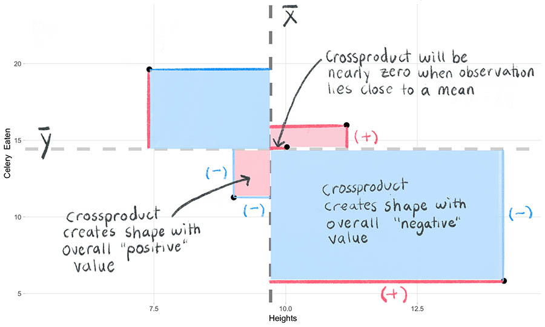

<div class="alert alert-info">
  **Module learning objectives:**
  <ol> 
  <li> Create a scatterplot using ggplot </li>
  <li> Identify the similarities and differences between calculating the variance and covariance </li>
  <li> Write a function for the covariance and Pearson's correlation coefficient </li>
  <li> Interpret the meaning behind Pearson's correlation correlation
  <li> Describe the purpose of dividing by the product of the standard deviations when calculating the correlation.</li>
  </ol>
</div>


# Gathering data on another variable
Over the course of your time on the islands, you notice that the teacup giraffes seem to have an affinity for celery, which you have already used to entice so they come close enough for a height measurement. Suprisingly, one of the small ones had eaten so much of it! You decide to quantify how much celery each of the giraffes consumed to see if there is any relationship to height.

You systematically measure the amount of celery eaten and add it to your log of data, which is stored as a data frame called `giraffe_data`.

We can check out the first entries of the data frame by using the `head( )` command:
```{r, echo= FALSE}

set.seed(12)
x1 <- rnorm(50, 10, 2)

x2 <- scale(matrix(rnorm(50), ncol=1))
x12 <- cbind(scale(x1),x2)

c1 <- var(x12)
chol1 <- solve(chol(c1))
newx <-  x12 %*% chol1

newc <- matrix(c(1,-0.52, -0.52, 1), ncol=2)
chol2 <- chol(newc)
finalx <- newx %*% chol2 * sd(x1) + mean(x1)

finalx[,2] <- (2*finalx[,2]-5)

giraffe_data <- finalx
colnames(giraffe_data) <- c("Heights", "Celery_Eaten")

giraffe_data <- as.data.frame(giraffe_data)
points <- giraffe_data[c(12, 50, 14, 43, 32),]
```

```{r}
head(giraffe_data)
```

# Make a scatter plot
It's difficult to get an idea if there's any relationship by just looking at the data frame. We learn so much more from creating a plot. Let's revisit our newly acquired ggplot skills to make a scatter plot.

A lot of the code used [previously](02_bellCurve.html) can be re-used for the scatter plot. Two main differences are the following:

(1) Because we now have an additional variable, we need to **assign a `y = ` for the `aes( )` command within `ggplot( )`**. Create the plot so that `Celery_Eaten` will be on the y-axis. 

(2) **Add (`+`) a `geom_point( )`** element instead of `geom_hist( )`


Also, we will add lines to our plot, representing the mean of each variable. Here's how we'll do that:

(3) **Add a horizontal line** by adding (`+`) a `geom_hline( )` component. This takes the argument `yintercept = `, which equals the value for where the horizontal line should cross the y-intercept. 
    * Since we want to place this line at the mean of y variable (${\bar{y}}$), we can use the `mean( )` function instead of specifying a numeric value directly.
 
(4) **Add a vertical line** by following the same structure as above but using `geom_vline( )` and `xintercept = ` instead. This vertical line will represent the mean (${\bar{x}}$) of the heights.

Construct a scatter plot of the data using the window below: 

<!---LEARNR EX 1-->

<iframe class="interactive" id="myIframe1" src="https://tinystats.shinyapps.io/05-correlation-ex1/" scrolling="no" frameborder="no"></iframe>

<!------------->

Great, now you have a scatter plot! But recalling the email from your advisor the last time you plotted data, you decide you'd like to customize the look of the plot the same way you did when you created the ggplot histogram. 

Play around with some aesthetics in the window below, and then run the solution to see what we chose. 

<!---LEARNR EX 2-->
<iframe class = "interactive" id="myIframe2" src="https://tinystats.shinyapps.io/05-correlation-ex2/
" scrolling="no" frameborder="no"></iframe>
<!------------->


Looking at the scatter plot, there seems to be a relationship between height and celery eaten, but you will need to quantify this more formally to be sure.

# Relationship between two variables
How can the relationship (and its strength) between two variables can be quantified? This can be done by assessing how the two variables change together-- one such measure is the **covariance**. 

The covariance elegantly combines the deviations of observations from two different variables into a single value. This is how it's done:

(1) As we did for the variance, we begin by measuring how far each observation lies from its mean. But unlike when we calculated the variance, each observation now includes two variables. We will need to **calculate the observation's distance from each variable's mean**. We call each distance the **deviation** scores on x and on y, respectively. Like the variance, the observation can fall above or below the mean, and as a result the corresponding deviation score will have either a positive or negative sign. 

We observe this below with a subset of 5 points from our scatter plot. Positive deviations are shown in red, negative deviations in blue. 

<center>{width=650px}</center>

Why do we use the deviations? Because we want to know whether the x-values and y-values move together with respect to their means or not. For example, when an observation's deviation on x is above $\bar{x}$, will its deviation on y also be above $\bar{y}$? Using this line of thought, we can begin to systematically characterize how "together" the x and y values will change as we go through all observations. 

# Crossproduct
After obtaining the deviation scores, we need to combine them into a single measure. We do not simply combine the deviation scores themselves by adding (please see the [page about the variance](04_variance.html) for a discussion of why this is). Instead, we take both deviation scores from the same observation and multiply them together to create a two-dimensional "shape" (analagous to when we multiplied a single deviation score by itself to create a square in the variance calculation).

**NOTE:** The resulting value is now on the order of a "squared" term. This will become important later.

(2) **Multiply the two deviation scores.** This is called the **crossproduct**. The shapes created by the crossproduct will serve as the "squared" terms that we can then use in the next step to sum and summarize the deviations into a single value. 

The equation is shown below for the *sample* crossproduct of the deviation scores. 

<div style="margin-bottom:50px">
</div>
\begin{equation}
 (\#eq:equation1)
 \Large (x_i - \bar{x})(y_i - \bar{y})
 \end{equation}
<div style="margin-bottom:50px">
</div>

 Let's explore the attributes of the crossproduct: 
 
 <div style="margin-bottom:50px">
</div>

  * First, we should note that the *overall sign* of the crossproduct will depend on whether or not the two x- and y- values from the same observation move in the same directions relative to their means. Look at the annotated plot below. The crossproducts will either create "negative" shapes (shown in blue) or "positive" shapes (in red). A third outcome is that the crossproduct could also be 0 -- this will occur when an observation falls on the mean.
  
  * Second, the **magnitude of the crossproduct** will scale with the absolute value of the deviation scores. In other words, the further away both deviation scores are from their means, the larger the area of their shapes will be.
  
<center>{width=650px}</center>

The animation below shows the "construction" of the crossproducts from the 5 observations we have been following:
 
```{r fig.show="animate", animation.hook = 'gifski', fig.width=7.2, fig.height=4.8, echo=FALSE, message=FALSE, warning=FALSE, results = 'hide', interval=0.01666667, fig.align='center', cache=TRUE, include=FALSE}
library(ggplot2)
set.seed(12)
x1 <- rnorm(50, 10, 2)

x2 <- scale(matrix(rnorm(50), ncol=1))
x12 <- cbind(scale(x1),x2)

c1 <- var(x12)
chol1 <- solve(chol(c1))
newx <-  x12 %*% chol1

newc <- matrix(c(1,-0.52, -0.52, 1), ncol=2)
chol2 <- chol(newc)
finalx <- newx %*% chol2 * sd(x1) + mean(x1)

finalx[,2] <- (2*finalx[,2]-5)

giraffe_data <- finalx
colnames(giraffe_data) <- c("Heights", "Celery_Eaten")

giraffe_data <- as.data.frame(giraffe_data)

points <- giraffe_data[c(12, 50, 14, 43, 32),]
m = mean(giraffe_data[,1])
m2 = mean(giraffe_data[,2])
co <- c("#289BF8", "#FF5E78", "#FF5E78", "#FF5E78", "#289BF8")
limx <- c(5.5, 14.4)
limy <- c(5.3, 23)

d <- data.frame(x1=points[,1], x2=m, y1=points[,2], y2=m2)
v <- do.call(cbind, lapply(1:5, function(x) seq(d[x,]$x1, d[x,]$x2, by = (d[x,]$x2-d[x,]$x1)/29)))
vv <- lapply(1:30, function(y) data.frame(x1=v[y,], x2=d$x1, y1=points[,2], y2=points[,2]))

pp <- function(x){
  p1 <- ggplot()+geom_point(data=points, aes(x=Heights, y=Celery_Eaten),color=co, size=4)+
    theme_light()+geom_segment(aes(x = x2, y = y1, xend = x1, yend = y1), data = x, color=co, size=2)+labs(x="Heights", y="Celery Eaten")+theme(panel.border=element_blank(),panel.grid.minor=element_blank(), axis.ticks=element_blank())+xlim(limx)+ylim(limy)+geom_vline(xintercept = mean(giraffe_data$Heights), col="grey50", linetype="dashed", size = 2) + geom_hline(yintercept = mean(giraffe_data$Celery_Eaten), col= "grey81", linetype="dashed", size= 2)
  p1
}

lapply(vv, function(x) pp(x))

h <- do.call(cbind, lapply(1:5, function(x) seq(d[x,]$y1, d[x,]$y2, by = (d[x,]$y2-d[x,]$y1)/29)))
hh <- lapply(1:30, function(y) data.frame(x1=points[,1], x2=m, y1=points[,2], y2=h[y,]))

pp2 <- function(x){
  p2 <- ggplot()+geom_point(data=points, aes(x=Heights, y=Celery_Eaten),color=co, size=4)+
    theme_light()+geom_segment(aes(x = x1, y = y1, xend = x2, yend = y1), data = d, color=co, size=2)+
  geom_segment(aes(x = x1, y = y2, xend = x1, yend = y1), data = x, color=co, size=2)+labs(x="Heights", y="Celery Eaten")+theme(panel.border=element_blank(),panel.grid.minor=element_blank(), axis.ticks=element_blank())+xlim(limx)+ylim(limy)+geom_vline(xintercept = mean(giraffe_data$Heights), col="grey50", linetype="dashed", size = 2) + geom_hline(yintercept = mean(giraffe_data$Celery_Eaten), col= "grey81", linetype="dashed", size= 2)
  p2
}

lapply(hh, function(x) pp2(x))

pp22 <- function(x){
  p2 <- ggplot()+theme_light()+geom_rect(data=d, mapping=aes(xmin=x1, xmax=x2, ymin=y1, ymax=y2), color=alpha(co, x),fill=co, alpha=x/5, size=2)+geom_segment(aes(x = x1, y = y1, xend = x2, yend = y1), data = d, color=co, size=2)+
  geom_segment(aes(x = x1, y = y2, xend = x1, yend = y1), data = d, color=co, size=2)+
    geom_point(data=points, aes(x=Heights, y=Celery_Eaten),color=co, size=4)+
    labs(x="Heights", y="Celery Eaten")+theme(panel.border=element_blank(),panel.grid.minor=element_blank(), axis.ticks=element_blank())+xlim(limx)+ylim(limy)+geom_vline(xintercept = mean(giraffe_data$Heights), col="grey50", linetype="dashed", size = 2) + geom_hline(yintercept = mean(giraffe_data$Celery_Eaten), col= "grey81", linetype="dashed", size= 2)
p2
}
lapply(seq(0,1,0.1), function(x) pp22(x))

pp3 <- function(x){
p3 <- ggplot()+theme_light()+geom_rect(data=d, mapping=aes(xmin=x1, xmax=x2, ymin=y1, ymax=y2), color=co,fill=co, alpha=0.2, size=2)+
  geom_point(data=points, aes(x=Heights, y=Celery_Eaten),color=co, size=4)+
  labs(x="Heights", y="Celery Eaten")+theme(panel.border=element_blank(),panel.grid.minor=element_blank(), axis.ticks=element_blank())+xlim(limx)+ylim(limy)+geom_vline(xintercept = mean(giraffe_data$Heights), col="grey50", linetype="dashed", size = 2) + geom_hline(yintercept = mean(giraffe_data$Celery_Eaten), col= "grey81", linetype="dashed", size= 2)
p3
}
lapply(1:15, function(x) pp3())
```

<video class="small_vid" controls disablePictureInPicture  controlslist="nodownload nofullscreen noremoteplayback" loop muted playsinline>
  <source src="images/05_correlation/lines.webm" type="video/webm">
  <source src="images/05_correlation/lines.mp4" type="video/mp4">
</video>

\
 
(3) **Sum the crossproducts.** The sum of the crossproduct gives us a single number.
<div style="margin-bottom:50px">
</div>
<center>{width=90%}</center>
<div style="margin-bottom:50px">
</div>

As we add the crossproducts, some of the "negative" and "positive" values of the shapes will cancel each other out. This is okay because this tells us important information about our two variables. If the negative and positive shapes cancel each other out completely, it would mean that there is no relationship. In most cases this will not happen, and the sum of the crossproducts will be positive or negative. In general, the larger the magnitude of the sum of the crossproducts, the more strongly the two variables move together. The equation is shown below.

<div style="margin-bottom:50px">
</div>
\begin{equation}
 (\#eq:equation2)
 \Large \sum_{i=1}^n (x_i - \bar{x})(y_i - \bar{y})
 \end{equation}
<div style="margin-bottom:50px">
</div>

# Covariance
(4) We then **divide the sum of the crossproduct by $n-1$ (or $N$ in the population equation)** so that we have taken into account how many observations contributed to this quantity. (Why $n-1$? See [here](04_variance.html).) This final number is called the **covariance**, and its value tells us how much our two variables fluctuate together. The higher the absolute value, the stronger the relationship.

The equation for the covariance (abbreviated "cov") of the variables x and y is shown below. As a preference of style, we multiply by $\frac{1}{n-1}$ instead of dividing the entire term by $n-1$. 

<div style="margin-bottom:50px">
</div>
\begin{equation}
 (\#eq:equation3)
 \Large cov(x,y) = {\frac{1}{n-1}\sum_{i=1}^n (x_i - \bar{x})(y_i - \bar{y})}
 \end{equation}
<div style="margin-bottom:50px">
</div>


# Problem of interpretation
However, the covariance is not an intuitive value. Remember that we have been working with terms that are on the "squared" scale, which is not only difficult to interpret (just like the variance is) but it is also the product of two variables on possibly different scales. How could we interpret a covariance with units of millimeters*grams mean?

Another point to make is that value of the covariance will be vastly different if we had decided to change the units (millimeters vs centimeters, or grams vs kilograms). 

As a result, the covariance is not an easy metric to work with or to compare with other covariances. So we need to standardize it!

# Pearson correlation coefficient, $r$
How do we standardize the covariance?

The solution is to (1) take the standard deviations of each variable, (2) multiply them together, and (3) divide the covariance by this product -- the resulting value is called the **Pearson correlation coefficient**. When referring to the population correlation coefficient, the symbol $\rho$ (pronounced "rho") is used. When referring to the sample correlation coefficient, a lowercase $r$ is used (often called "Pearson's r").

<div style="margin-bottom:50px">

Here is the equation for the **population correlation**:
</div>
\begin{equation}
 (\#eq:equation4)
 \Large \rho(x,y) = \frac{ \frac{1}{N} \sum_{i=1}^N (x_i - \mu_x)(y_i - \mu_y)}{\sigma_x \sigma_y}
 \end{equation}
<div style="margin-bottom:50px">
</div>

<div style="margin-bottom:50px">
</div>
This equation is used for the **sample correlation**:
\begin{equation}
 (\#eq:equation5)
 \Large r(x,y) = \frac{ \frac{1}{n-1} \sum_{i=1}^n (x_i - \bar{x})(y_i - \bar{y})}{s_x s_y}
 \end{equation}
<div style="margin-bottom:50px">
</div>

# What the does correlation mean?
We can interpret the correlation as a measure of **the strength and direction** of the relationship between two variables. It is a "standardized" version of the covariance. 

  * The correlation will always be between -1 and 1. At these extreme the values, the two variables have the strongest relationship possible, in which each data point will fall exactly on a line. When the absolute value of the correlation coefficient approaches 0, the observations will be more "scattered". 
  * The sign of the correlation coefficient indicates the direction of the linear relationship.  When $r$= 0 there is no relationship between the variables. Look at the figure below to see what observations of different $r$ values look like. 

<center>{width=90%}</center>  

**Your turn**

Imagine you're given a plot like the one below. What would you say it's correlation value is? Try out your guess for a few plots, and if you need a hint to help you visualize, click *Show trend line*.  


<!--------SHINY1------>
<iframe class="interactive" src="https://haswal.shinyapps.io/Guess_corr/?showcase=0" scrolling="no" frameborder="no"></iframe>

# Code it up

* In the window below, write your own function to compute the sample covariance of two variables, and call it `my_covariance( )`. 
* Then create a second function called `my_correlation( )` in which you will compute the correlation of two variables. You may incorporate your function `my_covariance( )` in this step to save yourself some time.
* Once you've created both functions, use them to compute the covariance and correlation between `Heights` and `Celery_Eaten` within the data frame `giraffe_data`.
* Finally, compare your functions' outputs with the base R functions for covariance, `cov( )` and `cor( )`. 

Remember, you will need to write both functions so that they will take two parameters, one for each variable. The parameters for `my_covariance( )` have been setup for you.

<!--LEARNR EX 3--->

<iframe class = "interactive" id="myIframe3" src="https://tinystats.shinyapps.io/05-correlation-ex3/" scrolling="no" frameborder="no"></iframe>

<!----------->

\

Wow, you can see that there is a negative relationship between giraffe heights and how much celery teacup giraffes eat. Could this be due to celery being a negative calorie vegetable? Are these giraffes onto something?

<center>{width=30%}</center>

# The Standardizer
You can take a look at the animation below to see a conceptual summary of how correlation will standarize the covariance, translating it into an easily interpretable metric that will always be bound by -1 and 1. 

<!-- # ```{r, fig.show='animate', animation.hook = 'gifski', interval= 0.15, fig.width=10, fig.height=5, echo=FALSE, results="hide", message=FALSE} -->
<!-- #  -->
<!-- # getwd() -->
<!-- #  -->
<!-- # library(jpeg) -->
<!-- # library(gifski) -->
<!-- # frames <- list.files(path="factory/") -->
<!-- #  -->
<!-- # factory <- function(x){ -->
<!-- # img <- readJPEG(paste0("factory/",frames[x]), native=TRUE) -->
<!-- # plot(0:1, 0:1, type="n", ann=FALSE, axes=FALSE) -->
<!-- # rasterImage(img,0,0,1,1) -->
<!-- # } -->
<!-- #  -->
<!-- # lapply(1:175, function(x) factory(x)) -->
<!-- #  -->
<!-- #  -->
<!-- # # gif_file <-  file.path(getwd(), 'factory.gif') -->
<!-- # # save_gif(lapply(1:175, function(x) factory(x)), gif_file= gif_file, progress = TRUE, loop= TRUE, delay= 0.5, width=400, height= 133) -->
<!-- # #  -->
<!-- # # utils::browseURL(gif_file) -->
<!-- #  -->
<!-- # ``` -->
<!---->

<video controls disablePictureInPicture controlslist="nodownload nofullscreen noremoteplayback" loop muted playsinline poster="images/05_correlation/factory.png">
  <source src="images/05_correlation/factory.webm" type="video/webm">
  <source src="images/05_correlation/factory.mp4" type="video/mp4">
</video>

# Why divide by $\sigma_x\sigma_y$? 
Well it's complicated, (see [here](https://www.quora.com/What-is-an-intuitive-explanation-for-why-the-sample-correlation-coefficient-is-equal-to-the-sample-covariance-divided-by-the-standard-deviations-of-x-and-y-multiplied-by-one-another) and [here](https://math.stackexchange.com/questions/158449/proving-that-the-magnitude-of-the-sample-correlation-coefficient-is-at-most-1)) but it builds on the mathematical principle that the covariance of x and y will never exceed the product of the standard deviations of x and y. This means that the maximum correlation value will occur when the absolute value of the covariance and the product of the standard deviations are equal. 


If you don't take our word for it, press play below to see what the relationship between ${s}_x{s}_y$ and ${cov(x,y)}$ looks like. 

```{r, tut=FALSE, echo=FALSE, message= FALSE, cache=TRUE}
library(MASS)
library(plotly)
library(here)

cor_var <- function(x){
  r <- 0
  d <- mvrnorm(n = 6, mu = c(0,0), Sigma = matrix(c(1, r, r, 2), nrow = 2))
  d <- round(d, 1)
  return(d)
}

d <- lapply(1:5006, function(x) cor_var())
dd <- as.data.frame(do.call(rbind, lapply(d, function(x) cbind(var(x)[1,1], var(x)[2,2], var(x)[1,2], cor(x)[1,2]))))
colnames(dd) <- c("var_x", "var_y", "cov_xy", "cor")
dd$p_sd <- sqrt(dd$var_x)*sqrt(dd$var_y)

ff <- function(x){
  d <- dd[1:x,]
  d$frame <- x+1
  return(d)
}

pd <- do.call(rbind, lapply(seq(99, 3000, 100), function(x) ff(x)))

p <- data.frame(var_x=Inf, var_y=Inf, cov_xy=Inf, cor=0, p_sd=Inf, frame=0)
pd <- rbind(pd, p)
pd <- round(pd, 2)

m <- list(
  l = 100,
  r = 100,
  b = 10,
  t = 10,
  pad = 4
)

p <- pd %>%
  plot_ly(
    width=700, 
    height=450,
    type = 'scatter',
    mode='markers',
    x = ~cov_xy,
    y = ~p_sd,
    frame = ~frame,
    color = ~cor,
    colors = c("#289BF8","#FF5E78"),
    marker = list(size = 12, opacity=1),
    hoverinfo="text",
    text=~paste("Covariance:", round(cov_xy, 2), "\nPooled SD:",
                round(p_sd, 2))
  )%>% 
  animation_opts(
    frame = 100,
    transition = 0,
    redraw = FALSE
  )%>%
  config(displayModeBar = F) %>%
  layout(margin= m, autosize=F,
    xaxis = list(range=c(-3,3), zeroline=FALSE, title="Covariance"),
    yaxis = list(range=c(-0.1,4.5), zeroline=FALSE, title="Product of standard deviations")
    )%>%
  animation_slider(currentvalue = list(prefix = "Number of Samples: ", font = list(color="grey70", size=14)))

htmltools::save_html(p,here("images/05_correlation/cov_vs_sxsy.html"))

```
<center><iframe style="margin: 0;" src="images/05_correlation/cov_vs_sxsy.html" width="720" height="500" scrolling="yes" seamless="seamless" frameBorder="0"> </iframe></center>

As you look at the plot above, you may have the following questions:

  * Why are there clearly defined boundaries?
  
    + Because at the edges is where the covariance is the greatest value that it can be-- it is equal to the product of the standard deviations there.
    
    + The slope is 1 at this boundary.
    
  * Where in the plot do the strongest correlations end up?
  
      + On the edges -- when the absolute value of the numerator and denominator of the equation are equal-- the quotient will = 1 (or negative 1, depending on the sign of the covariance in the numerator).
    
# Things to think about

**Correlation does not capture relationships that are not linear**: If the relationship is not linear, then correlation will not be meaningful. Check out the plot below. There is a clear U-shaped relationship between the two variables, but the correlation coefficient for these data is very close to 0. To meausure non-linear relationships a different metric must be used.

<center>{width=40%}</center>
  

**Correlation is not causation**: Just because there is a linear relationship between two variables does not mean we have evidence that one variable causes the other. Even if there really was a cause-and-effect relationship, with correlation we cannot say which variable is the cause and which is the effect. It's also possible that there exists some other unmeasured variable affecting the linear relationship we observe. And of course, any apparent relationship may be due to nothing more than random chance.  

<script>
  iFrameResize({}, ".interactive");
</script>