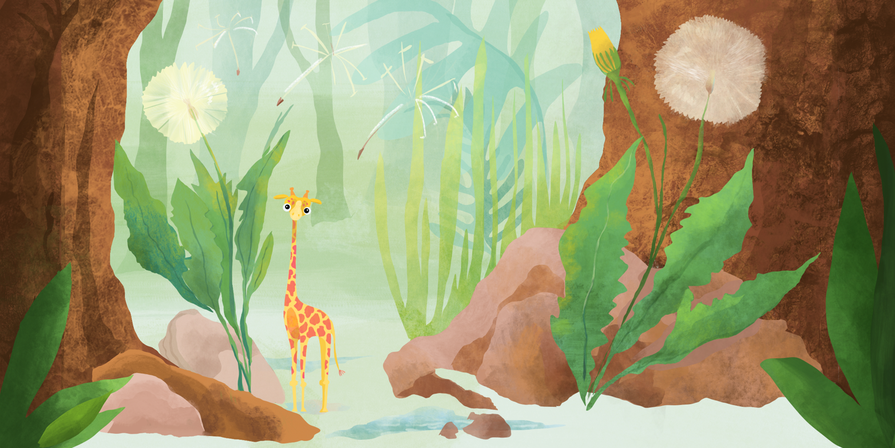
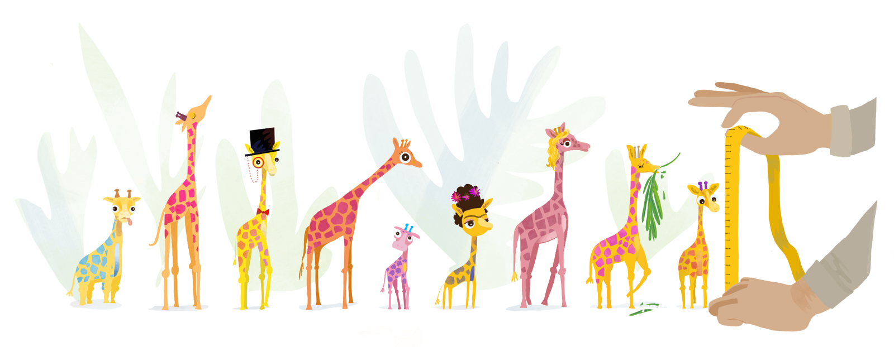
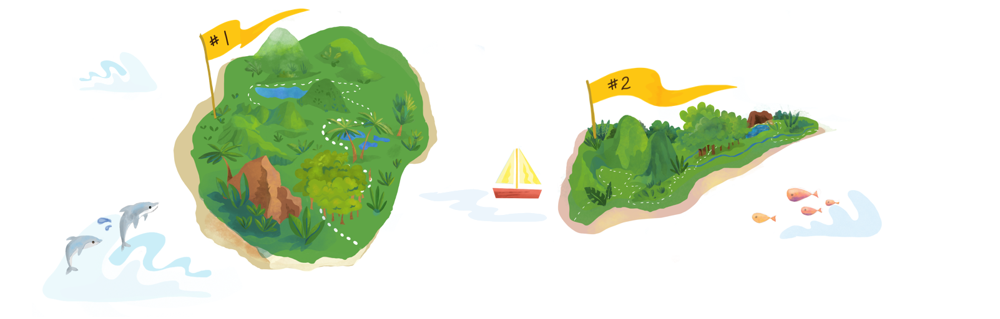

<!-- <link href="style.css" rel="stylesheet" /> -->

```{r setup, include=FALSE}
knitr::opts_chunk$set(echo = TRUE)
```

# Welcome to the island

You arrive on the island, and you're excited to collect data on a new species. All you know is that they are small giraffe-like creatures. After suiting up in your field gear, your guide leads you deep into the dense island brush, and you scan the ground for your first subject.

After a one hour hike, you reach a clearing where tall cypress trees encircle low growth vegetation. You experience your first encounter with a little giraffe, whose cool drink from a puddle you seem to have interrupted. Its slender body does not even clear the height of a dandelion. You toss an apple core in its direction, and you're pleasantly surprised that it trots over to you and begins hopping on and off your muddy boots in play. After observing this behavior for a while, you bring out your measuring tape and record its height. 

<div style="margin-top:50px">
</div>
<center>{width=800px}</center>
<div style="margin-bottom:50px">
</div>

Shortly after you leave the clearing, you spot another little giraffe sliding down a rock, stopping directly in your path. You're surprised how much larger this one is--about as tall as a banana. This pattern repeats itself, and you realize that although all small, mini-giraffes are variable in size.


The next week is spent trekking and measuring every giraffe you can manage to bring near enough. You've capitalized on the fact that they seem to find the pistachios from your lunch very tasty, and you're relieved that they seem to be sufficiently social to approach long enough for a reliable measurment with your tape measure. With the help of your guide, you manage to measure 50 giraffes in the first week.

<p><div style="margin-top:50px"></div>
<center>{width=800px}</center>
<div style="margin-bottom:50px"></div></p>

There is a second island not too far away, where you guide has indicated there may be more giraffes. You wonder how the population of giraffes on the second island may be different, and so you make arrangements to go to Island #2 the following week. It is not too long until you have added another 50 measurements of these tiny giraffes from this second excursion.

<p><div style="margin-top:50px"></div>
<center>{width=800px}</center>
<div style="margin-bottom:50px"></div></p>


# The Data
<!-- You record the data below in your logbook, and you make a plot to get a sense of how tall the tiny giraffes really are. -->

After a nice lunch on the beach, you decide to take a first look at the data. What's the best way to look at data when you know nothing about it...?

You can start by scanning the data for the shortest and tallest heights. You see the range is between 6 and 20 cm. So you draw a ruler in the sand with the extreme heights on either end. You'd like to see how many times each height occurs in your data set, and so you grab a little leaf to represent each individual giraffe's height and place it just above your ruler mark. You put out a new leaf for each height and continue doing this for each individual to see which heights "stack up" along your ruler. To keep track of which heights came from different islands, you pick differently colored leaves for each group. Look below for a sped-up version of this process! The y-axis is frequency. The x-axis is the heights.

```{r, include=FALSE}
knitr::opts_chunk$set(echo = TRUE)

library(plotly)
library(tweenr)

set.seed(12)
x <- round(rnorm(50, 10, 2))
x2 <- round(rnorm(50, 18, 1.2))
x <- c(x,x2)
df <- data.frame(x = x, y = 23, type=rep(c('Island #1', 'Island #2'), each=50))
dfs <- list(df)
for(i in seq_len(nrow(df))) {
    dftemp <- tail(dfs, 1)
    dftemp[[1]]$y[i] <- sum(dftemp[[1]]$x[seq_len(i)] == dftemp[[1]]$x[i])
    dfs <- append(dfs, dftemp)
}
dfs <- append(dfs, dfs[rep(length(dfs), 3)])
dft <- tween_states(dfs, 10, 1, 'cubic-in', 500)
dft$y <- dft$y - 0.5
dft <- dft[dft$y != 23, ]

m <- list(
  l = 50,
  r = 50,
  b = 10,
  t = 10,
  pad = 4
)

p <- dft %>%
  plot_ly(
    x = ~x, 
    y = ~y,
    frame = ~.frame, 
    color = ~type,
    colors = c("green3", "turquoise3"),
    marker = list(size = 16),
    width=630, 
    height=390
  )  %>% 
config(displayModeBar = F) %>%
  layout(
    xaxis = list(range=c(4,23),
      title = "Teacup Giraffe heights",
      zeroline = F
    ),
    yaxis = list(range=c(-0.5,21),
      title = "Frequency",
      zeroline = F
    ),legend = list(x = 0.075, y = 0.91), autosize=F, margin=m
  ) %>% 
  animation_opts(
    frame = 50, 
    transition = 0, 
    redraw = FALSE
  ) %>%
  animation_slider(
    hide = T
    ) %>%
  animation_button(
    x = 1, xanchor = "right", y = 0, yanchor = "bottom"
  )
p

htmltools::save_html(p, file="two_animated_hist.html")
```
<div style="margin-top:30px">
</div>
<center>
<iframe style="margin:0px; padding:0px; display:block; border:0px" src="two_animated_hist.html" width="650" height="450" scrolling="yes" seamless="seamless" frameBorder="0"> </iframe>
</center>

As you put the last leaf in place, your local guide saunters by and glances at your markings, "Oh nice, you've made a histogram!" 

Happy with your progress thus far, you are excited to send your histogram results to your PhD mentor back in the homeland. Instead of taking a picture of your leaf histogram, you turn to R to create the perfect figure.

# Our Dataframe
<div style="margin-top:30px">
</div>

The heights from your logbook have been stored in a dataframe called `d`. Below we show the last few observations from this vector, using the `tail()` function, which all happen to be from Island #2.

<div style="margin-bottom:15px">
</div>

```{r, echo=FALSE}
set.seed(12)

x <- rnorm(50, 10, 2)
x2 <- rnorm(50, 18, 1.2)
x <- data.frame(x=x, type="Island #1")
x2 <- data.frame(x=x2, type="Island #2")

d <- rbind(x,x2)
colnames(d) <- c("Height", "Location")
```

```{r, echo=TRUE}
tail(d)
```


# Making a histogram with `ggplot2`

We will use the *ggplot2* package for all our graphing. There are many different ways that ggplot can be customized. Check out [this page](https://ggplot2.tidyverse.org/reference) as a reference. 

We need some basic components as a bare minimum to get started. We can layer nicer components on top of this later to make the graph look nice. Our steps:

(1) Specify the dataframe that we want to use using `ggplot()`. We will do this using the option `data =`. We also have to tell ggplot *what* to actually plot-- we do this with the argument that stands for aesthetics: `aes()`. In our case, only the x-axis variable `Height` needs to be specified.

(2) Add a `geom` layer, which is the visual representation of the data points. In contrast to other ways we write code in R, ggplot options are added using a plus sign `+`. 
In our case, we will write `+` and then `geom_histogram()`. To make your plot look similar to your sand drawing, you want to add an optional argument within the parentheses of `geom_histogram`, which will set the bin width to 1 cm: `geom_histogram( binwidth = 1 ).

Here we are using `geom_histogram`, but there are many other `geom_` layers that you could use instead for different plot types. Check some of them out [here](https://ggplot2.tidyverse.org/reference/#section-layer-geoms).

A note about the `+`: You can keep adding new specifications on one long continuous line of code, separating each one with a `+`.  However, if you'd like to make the code easier to read by adding each specification to a new line, make sure the `+` to the end of the first line and not the new one.

It's a good idea to save any ggplot you make as an object. It's a helpful practice for when you'll do more complicated graphing later (e.g. combining plots).

Run the code below to see what this basic histogram in ggplot looks like:

<div style="margin-bottom:15px">
</div>

```{r, include=FALSE}
tutorial::go_interactive(height = 160)
```

```{r ex="histogram", type="pre-exercise-code"}
library(ggplot2)

set.seed(12)

x <- rnorm(50, 10, 2)
x2 <- rnorm(50, 18, 1.2)
x <- data.frame(x=x, type="Island #1")
x2 <- data.frame(x=x2, type="Island #2")

d <- rbind(x,x2)
colnames(d) <- c("Height", "Location")
```

```{r ex="histogram", type="sample-code"}

p <- ggplot(data = d, aes(x = Height)) + 
  geom_histogram(binwidth=1)

p


```

Let's go over some quick ways we can make any ggplot look nicer. First, we need to tell ggplot that we want the data from the two islands to be different colors. And second, we need to specify the colors we want to use. 

**Different color for each group:** Under aes(), we add a `fill =` argument. Here is where you put the name of the variable that contains the categories that you want to distinguish with different colors. To choose colors ggplot should use, we need to add a new function ` + scale_fill_manual()` and then specify the actual colors with `values = `. To read more about how to create your own color scale, see this [page](https://ggplot2.tidyverse.org/reference/scale_manual.html). If you have more than one color you need to specify, make sure you combine them with the `c()` function. 

Colors in R can be specified in different ways. For example, you can use a string of the color name. See possible colors [here](http://sape.inf.usi.ch/quick-reference/ggplot2/colour). 

**Outline Color:** To add a colored outline around the data contained in your `geom_` (i.e. the bars for 'geom_histogram'), specify `color = ` within the parentheses for the geom. 


In the window below, we have added some options that you can play around with. Use the descriptions above to specify the correct variable that `fill` should be set to as well as the fill and outline colors.

Try out some color specifications on your own, and then check out the solution to see what we picked.

```{r ex="histogram1", type="pre-exercise-code"}
library(ggplot2)

set.seed(12)

x <- rnorm(50, 10, 2)
x2 <- rnorm(50, 18, 1.2)
x <- data.frame(x=x, type="Island #1")
x2 <- data.frame(x=x2, type="Island #2")

d <- rbind(x,x2)
colnames(d) <- c("Height", "Location")
```

```{r ex="histogram1", type="sample-code"}
#Fill in the incomplete arguments below

p <- ggplot(data = d, aes(x = Height, fill = )) +
  geom_histogram(binwidth = 1, color = ) +
  scale_fill_manual(values = c( ))
  
p

```

```{r ex="histogram1", type="solution"}

p <- ggplot(data = d, aes(x = Height, fill = Location)) +
  geom_histogram(binwidth = 1, color = "white") +
  scale_fill_manual(values = c("green3", "turquoise3"))
  
p

```

**Playing around with "complete themes": ** ggplot has a nice way of changing many non-data display parameters at once though what is referred to as "complete themes". Check this [page](https://ggplot2.tidyverse.org/reference/ggtheme.html) for the available options.

Have fun testing out a few different complete themes by adding the argument with a `+` sign. Try 3 different ones and take note of how the plot changes.

```{r ex="histogram2", type="pre-exercise-code"}
library(ggplot2)

set.seed(12)

x <- rnorm(50, 10, 2)
x2 <- rnorm(50, 18, 1.2)
x <- data.frame(x=x, type="Island #1")
x2 <- data.frame(x=x2, type="Island #2")

d <- rbind(x,x2)
colnames(d) <- c("Height", "Location")

```

```{r ex="histogram2", type="sample-code"}
# Add a complete theme to existing code

p <- ggplot(data = d, aes(x = Height, fill = Location)) +
  geom_histogram(binwidth = 1, color = "white") +
  scale_fill_manual(values = c("green3", "turquoise3"))

p

```

```{r ex="histogram2", type="solution"}
# Add a complete theme to existing code

p <- ggplot(data = d, aes(x = Height, fill = Location)) +
  geom_histogram(binwidth = 1, color = "white") +
  scale_fill_manual(values = c("green3", "turquoise3")) + theme_light()

p

```
If you're not wholly happy with any of the complete themes, you can add a `theme()` argument to tweak the display of the existing theme. To read more about how to modify componenets of a complete theme, check out this [resource](https://ggplot2.tidyverse.org/reference/theme.html).

You pick `theme_light()` and you feel pretty good about your ggplot accomplishment. You send your plot to your PhD advisor, and within what feels like only minutes, you have a new attachment in your email inbox:

```{r, echo=FALSE}
# p <- ggplot(data = d, aes(x = Height, fill = Location)) +
#   geom_histogram(binwidth = 1, color = "white")+
#   scale_fill_manual(values = c("green3", "turquoise3")) + theme_light()
# 
# ggsave(filename = "/Users/Desiree/Documents/New R Projects/Cars/advisor_email.png", width=5, height=3, p)

```
<p style=><center>
{width=600px}
</center>
<div style="margin-bottom:25px"></div>

Lets start with something easy: removing the space between the bars and the x-axis. In ggplot... 

```{r ex="histogram3", type="pre-exercise-code"}
library(ggplot2)

set.seed(12)

x <- rnorm(50, 10, 2)
x2 <- rnorm(50, 18, 1.2)
x <- data.frame(x=x, type="Island #1")
x2 <- data.frame(x=x2, type="Island #2")

d <- rbind(x,x2)
colnames(d) <- c("Height", "Location")

```

```{r ex="histogram3", type="sample-code"}
# Remove space between bars and x-axis, and change labels

p <- ggplot(data = d, aes(x = Height, fill = Location)) +
  geom_histogram(binwidth = 1, color = "white") +
  scale_fill_manual(values = c("green3", "turquoise3")) + 
  theme_light() +
  scale_y_continuous(expand = ) +
  labs()

p

```

```{r ex="histogram3", type="solution"}
# Remove space between bars and x-axis, and change labels

p <- ggplot(data = d, aes(x = Height, fill = Location)) +
  geom_histogram(binwidth = 1, color = "white") +
  scale_fill_manual(values = c("green3", "turquoise3")) + 
  theme_light() +
  scale_y_continuous(expand = c(0,0)) +
  labs(x="Teacup Giraffe heights", y="Frequency", fill=NULL)
  
p

```

**Labels, axes, and plot background:** 

```{r ex="histogram4", type="pre-exercise-code"}
library(ggplot2)

set.seed(12)

x <- rnorm(50, 10, 2)
x2 <- rnorm(50, 18, 1.2)
x <- data.frame(x=x, type="Island #1")
x2 <- data.frame(x=x2, type="Island #2")

d <- rbind(x,x2)
colnames(d) <- c("Height", "Location")

```

```{r ex="histogram4", type="sample-code"}
# Remove panel border and minor grid lines

p <- ggplot(data = d, aes(x = Height, fill = Location)) +
  geom_histogram(binwidth = 1, color = "white") +
  scale_fill_manual(values = c("green3", "turquoise3")) + 
  theme_light() +
  scale_y_continuous(expand = c(0,0)) +
  labs(x="Teacup Giraffe heights", y="Frequency", fill=NULL) +
  theme()

p

```

```{r ex="histogram4", type="solution"}
# Remove panel border and minor grid lines

p <- ggplot(data = d, aes(x = Height, fill = Location)) +
  geom_histogram(binwidth = 1, color = "white") +
  scale_fill_manual(values = c("green3", "turquoise3")) + 
  theme_light() +
  scale_y_continuous(expand = c(0,0)) +
  labs(x="Teacup Giraffe heights", y="Frequency", fill=NULL) +
  theme(panel.border=element_blank(), panel.grid.minor=element_blank())

p

```


```{r ex="histogram5", type="pre-exercise-code"}
library(ggplot2)

set.seed(12)

x <- rnorm(50, 10, 2)
x2 <- rnorm(50, 18, 1.2)
x <- data.frame(x=x, type="Island #1")
x2 <- data.frame(x=x2, type="Island #2")

d <- rbind(x,x2)
colnames(d) <- c("Height", "Location")

```

```{r ex="histogram5", type="sample-code"}
# Move legend

p <- ggplot(data = d, aes(x = Height, fill = Location)) +
  geom_histogram(binwidth = 1, color = "white") +
  scale_fill_manual(values = c("green3", "turquoise3")) + 
  theme_light() +
  scale_y_continuous(expand = c(0,0)) +
  labs(x="Teacup Giraffe heights", y="Frequency", fill=NULL) +
  theme(panel.border=element_blank(), panel.grid.minor=element_blank(), legend.position = , legend.background = ) +

p

```

```{r ex="histogram5", type="solution"}
# Move legend

p <- ggplot(data = d, aes(x = Height, fill = Location)) +
  geom_histogram(binwidth = 1, color = "white") +
  scale_fill_manual(values = c("green3", "turquoise3")) + 
  theme_light() +
  scale_y_continuous(expand = c(0,0)) +
  labs(x="Teacup Giraffe heights", y="Frequency", fill=NULL) +
  theme(panel.border=element_blank(), panel.grid.minor=element_blank(), legend.position = c(0.165,0.92), legend.background = element_blank())

p

```


#Creates a Bell Curve
The normal curve is shaped like a bell


#Bell Curves come in different shapes and sizes

Introduce mu and sigma: Mu is center point. Sigma indicating width. 2x2 grid, showing 4 different distributions. 

 ** make the point that have different shapes. 
 
The giraffes on the south side of the island have a bell curve A..
The giraffes on the north side of the island have bell curve B...

...might be overlapping too much with Variance.

# Create your own histogram


### Sampling
Since we can't take the height of EVERY giraffe on the islands, and it is unclear how many giraffes live on the island, we have to rely on taking the heights of randomly selected groups of giraffes. Let's measure 100 different animals that were captured at various locations of the island terrain.

