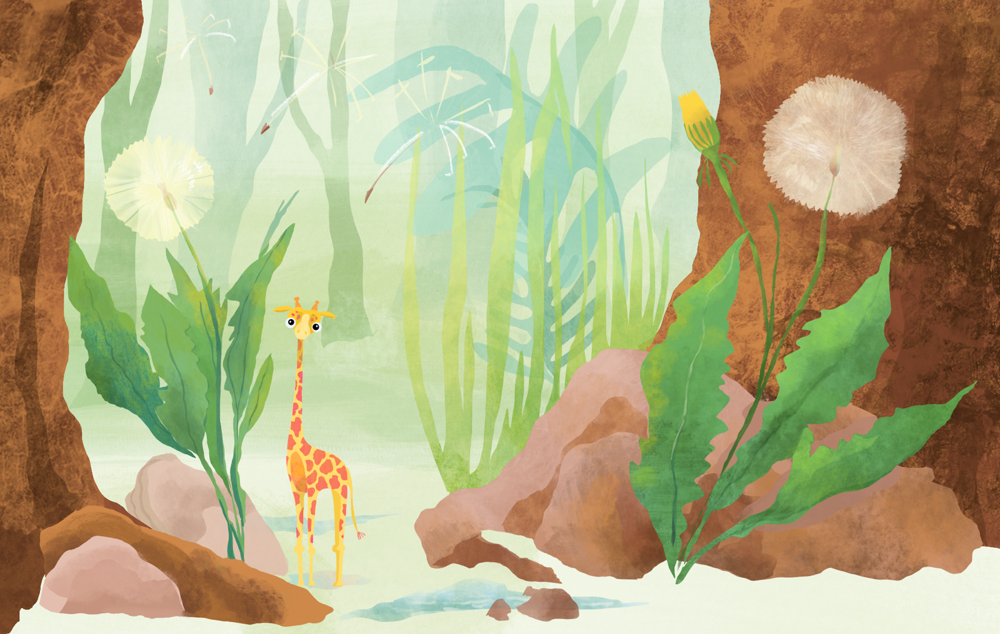
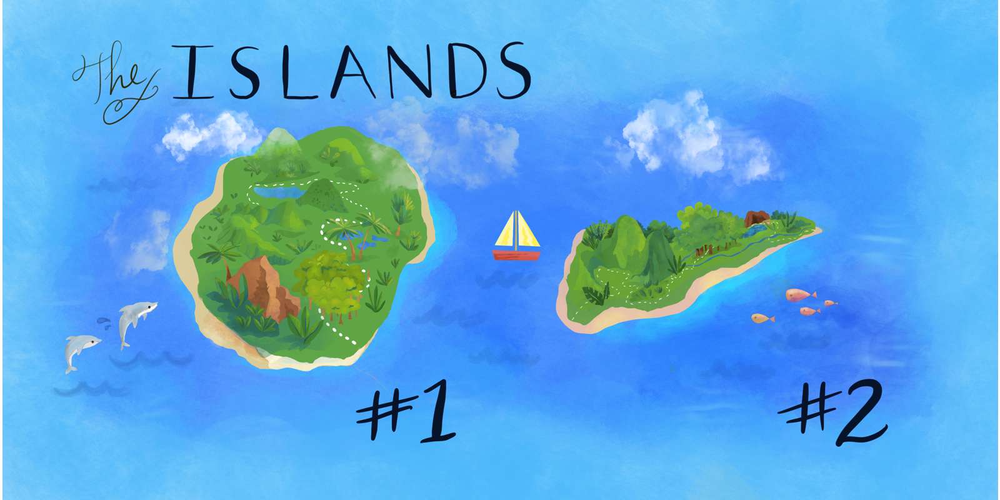

```{r setup, include=FALSE}
knitr::opts_chunk$set(echo = TRUE)
```

# Welcome to the island

You arrive on the island, and you're excited to collect data on a new species. All you know is that they are small giraffe-like creatures. After suiting up in your field gear, your guide leads you deep into the dense island brush, and you scan the ground for your first subject.

After a one hour hike, you reach a clearing where tall cypress trees encircle low growth vegetation. You experience your first encounter with a little giraffe, whose cool drink from a puddle you seem to have interrupted. Its slender body does not even clear the height of a dandelion. You toss an apple core in its direction, and you're pleasantly surprised that it trots over to you and begins hopping on and off your muddy boots in play. After observing this behavior for a while, you bring out your measuring tape and record its height. 

Shortly after you leave the clearing, you spot another little giraffe sliding down a rock, stopping directly in your path. You're surprised how much larger this one is--about as tall as a banana. This pattern repeats itself, and you realize that although all small, mini-giraffes are variable in size.

<div style="margin-top:50px">
</div>
<center>{width=800px}</center>
<div style="margin-bottom:50px">
</div>

The next week is spent trekking and measuring every giraffe you can manage to bring near enough. You've capitalized on the fact that they seem to find the pistachios from your lunch very tasty, and you're relieved that they seem to be sufficiently social to approach long enough for a reliable measurment with your tape measure. With the help of your guide, you manage to measure 50 giraffes in the first week.

<p><div style="margin-top:50px"></div>
<center>{width=800px}</center>
<div style="margin-bottom:50px"></div></p>

(Introduce the existence of the nearby (additional) island with small giraffes. Insert narrative for island #2 -- take measurements from 2nd island)

<p><div style="margin-top:50px"></div>
<center>{width=800px}</center>
<div style="margin-bottom:50px"></div></p>


## The Data
You record the data below in your logbook, and you make a plot to get a sense of how tall the tiny giraffes really are.

# Histogram
Each time you log a giraffe within a height range, you note how frequently a giraffe of this height has been recorded. Y-axis is frequency. X-axis is the height range

```{r, include=FALSE}
knitr::opts_chunk$set(echo = TRUE)

library(plotly)
library(tweenr)

set.seed(12)
x <- round(rnorm(50, 10, 2))
x2 <- round(rnorm(50, 18, 1.2))
x <- c(x,x2)
df <- data.frame(x = x, y = 23, type=rep(c('Island #1', 'Island #2'), each=50))
dfs <- list(df)
for(i in seq_len(nrow(df))) {
    dftemp <- tail(dfs, 1)
    dftemp[[1]]$y[i] <- sum(dftemp[[1]]$x[seq_len(i)] == dftemp[[1]]$x[i])
    dfs <- append(dfs, dftemp)
}
dfs <- append(dfs, dfs[rep(length(dfs), 3)])
dft <- tween_states(dfs, 10, 1, 'cubic-in', 500)
dft$y <- dft$y - 0.5
dft <- dft[dft$y != 23, ]

m <- list(
  l = 50,
  r = 50,
  b = 10,
  t = 10,
  pad = 4
)

p <- dft %>%
  plot_ly(
    x = ~x, 
    y = ~y,
    frame = ~.frame, 
    color = ~type,
    colors = c("green3", "turquoise3"),
    marker = list(size = 16),
    width=630, 
    height=390
  )  %>% 
config(displayModeBar = F) %>%
  layout(
    xaxis = list(range=c(4,23),
      title = "Teacup Giraffe heights",
      zeroline = F
    ),
    yaxis = list(range=c(-0.5,21),
      title = "Frequency",
      zeroline = F
    ),legend = list(x = 0.075, y = 0.91), autosize=F, margin=m
  ) %>% 
  animation_opts(
    frame = 50, 
    transition = 0, 
    redraw = FALSE
  ) %>%
  animation_slider(
    hide = T
    ) %>%
  animation_button(
    x = 1, xanchor = "right", y = 0, yanchor = "bottom"
  )
p

htmltools::save_html(p, file="two_animated_hist.html")
```
<div style="margin-top:30px">
</div>
<center>
<iframe style="margin:0px; padding:0px; display:block; border:0px" src="two_animated_hist.html" width="650" height="450" scrolling="yes" seamless="seamless" frameBorder="0"> </iframe>
#Creates a Bell Curve
The normal curve is shaped like a bell


#Bell Curves come in different shapes and sizes

Introduce mu and sigma: Mu is center point. Sigma indicating width. 2x2 grid, showing 4 different distributions. 

 ** make the point that have different shapes. 
 
The giraffes on the south side of the island have a bell curve A..
The giraffes on the north side of the island have bell curve B...

...might be overlapping too much with Variance.

# Create your own histogram


### Sampling
Since we can't take the height of EVERY giraffe on the islands, and it is unclear how many giraffes live on the island, we have to rely on taking the heights of randomly selected groups of giraffes. Let's measure 100 different animals that were captured at various locations of the island terrain.


