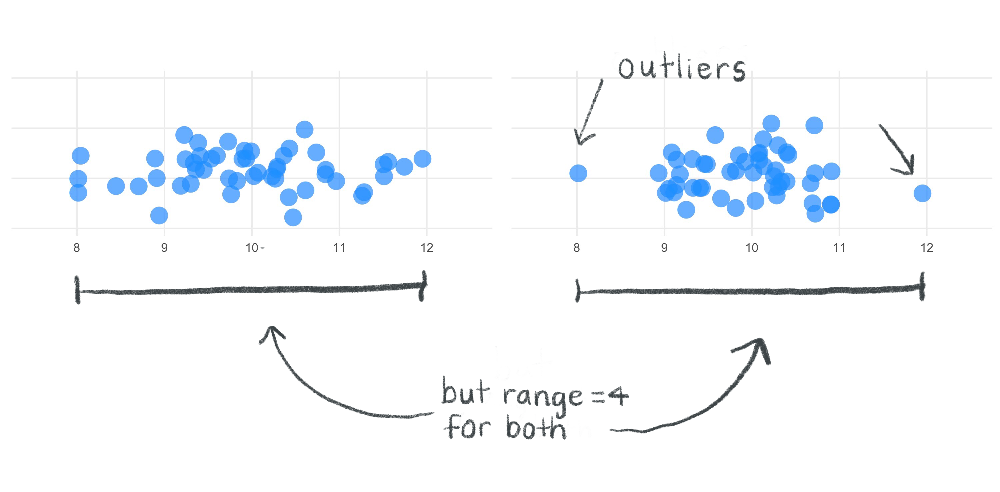
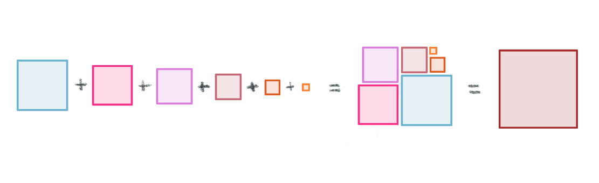
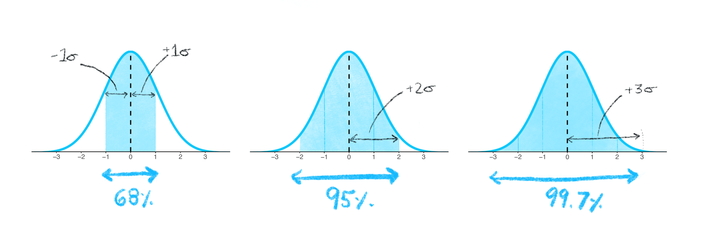
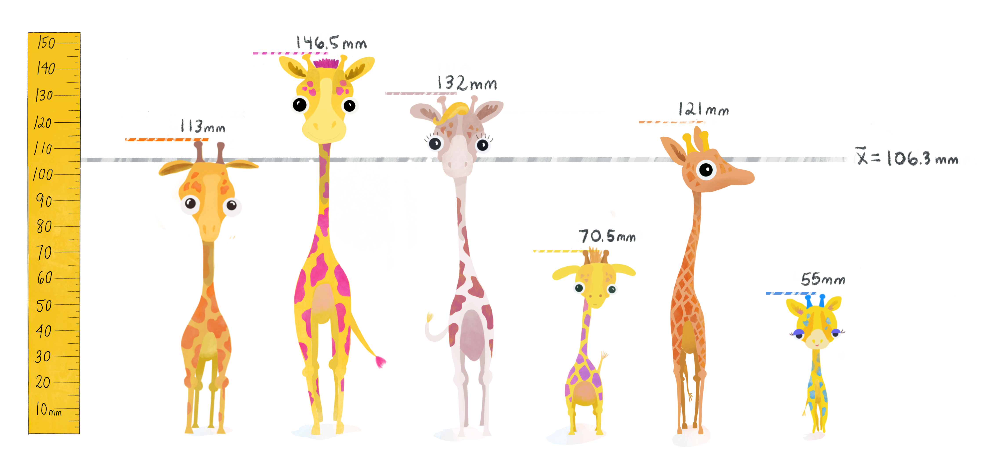
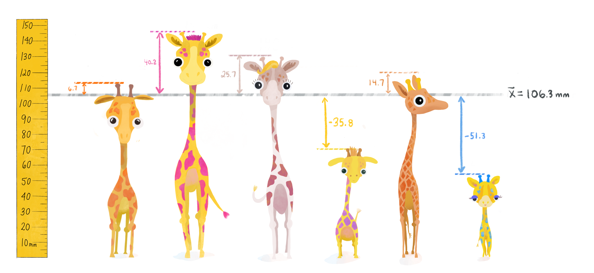

<div class="alert alert-info">
  **Module learning objectives:**
  <ol> 
  <li> Describe how the standard deviations can allow us to forecast which data values will be common or rare   </li>
  <li> Write a function for the variance and standard deviation </li>
  <li> Explain why the sample variance would be downwardly biased if we did not correct it by diving by (N-1) </li>
  </ol>
</div>

<!-- <link href="styles.css" rel="stylesheet">  -->
<!--         <div class="image-descript"> -->
<!-- 					 -->
<!-- 					<div class="color-overlay"></div> -->
<!-- 					<div class="image-text"> -->
<!-- 						<div class="lil-image-text">Tiny Giraffes</div> -->
<!-- 						<div class="big-image-text"><strong>Big Questions</strong></div> -->
<!-- 					</div> -->
<!-- 				</div> -->


```{r setup, include=FALSE}
knitr::opts_chunk$set(echo = TRUE)
```


# Measures of spread
After successfully calculating the mean, you return to the memory of the first day you had collected your data. There was one teacup giraffe that was your favorite-- it was especially cute! After a few days, you get acquainted with this very small one. The favorite. How rare is its smallness?

<center>{width=600px}</center>
You return back to the data and you wonder-- how do you formally assess how spread out the values of height are among these small animals?

You might start by calculating the simplest **measure of spread**, the **range**. This gives us a rough idea of the kinds of heights we can expect on a very basic level. But the range seems to ignore important contextual information. For example, two data sets can have very different spreads but still have the same range.

<center>{width=600px}</center>

If we want to avoid undue influence of outliers for the measure of spread, the range is not good enough to provide us with a wholisitc, robust measure of all the data in the set.

What is a more stable measurment? The answer is the **variance**.

# Variance in plain language
You need a solid understanding of variance in order to grasp the mechanics of any statistical test. But what does the concept variance really capture?

  * Recall the normal distribution: When we inspect the distributions below visually, we see that they all have the same mean, but we can see that some distributions are more spread out. Bell curves that are more "squished together" are composed of observations that are more similar to one another, while bell curves that are more "spread out" are composed of observations that have greater variability. Wider bell-curves mean greater variance! In plain language, the variance gives us an idea of how similar observations are to one another, and to the average value. 
  
  

#How to calculate variance
Let's begin by going through the steps and equations for calcuating the variance of the *population*. We'll explain how to modify this for calculating the *sample* variance later on.

First, the idea is to capture how far away individual observations lie from the mean. In other words, we could subtract the mean from each height. This is called the **deviation** from the mean (not to be confused with the statistical term *deviance*). And since, we're calculating the *population* variance, we will use $\mu$ for the mean instead of ${\bar{x}}$ (which is only used for samples). 

Calculating the deviations is a great start, but we're back to the problem of needing to summarize multiple values. Since these newly calculated values are both negative and positive, we quickly realize that adding them up (like the first step when calculating the mean) would not be a productive idea since the negatives cancel the positives.

What's the easiest thing to do when you want to retain how far away a point is from the mean irrespective of whether it's above or below the mean? How about taking the absolute value?

## Why we don't take the absolute value
Though the absolute value would be a valid measure of the deviation, it turns out that it has some mathematical properties that don't make it the best choice, especially for more complex statistial analyses involving the variance later down the line. (As an example, in calculus, the function for the absolute value is not differentiable when x=0, which makes optimizing these functions more difficult).

## Why we square the deviations
There is an alternative with simpler, "better behaved" mathematical properties: **taking the differences from the mean and squaring them**. Squaring will always give us a positive values, so the values can never cancel each other out (and in contrast to the absolute value, the squared differences will be continuously differentiable. It's worth pointing out, however, that a consequence of squaring deviations will tend to amplify the influence of values at extreme distances from the mean. You can read [this thread](https://stats.stackexchange.com/questions/118/why-square-the-difference-instead-of-taking-the-absolute-value-in-standard-devia) for a more detailed discussion about absolute values versus the squared deviations.). Now we have positive, squared deviation values that we can be summed to a single total. We call this total **the sum of squares**. 

<div style="margin-bottom:50px">
</div>
\begin{equation}
 (\#eq:equation1)
 \Large {\sum_{i=1}^n (x_i - \mu)^2}
 \end{equation}
<div style="margin-bottom:50px">
</div>

# Sum of Squares
The sum of squares is an important calculation that we will see again for other statistical operations. The animation below illustrations how these sums of squares are "constructed" starting with the sample observations and then squaring each one's distance away from the mean.  

```{r fig.show="animate", animation.hook = 'gifski', fig.width=7.2, fig.height=4.8, echo=FALSE, message=FALSE, warning=FALSE, results = 'hide', interval=0.01666667, fig.align='center'}
library(ggplot2)
s <- data.frame(x=c(113, 146.5, 132, 70.5, 121, 55), y=c(8.75,1.25,3.75,3.75,6.25,1.25))
s <- s[order(s$x),]
s <- s[c(1,2,3,6,5,4),]
s2 <- s
s <- s[c(1,2,6,5,4,3),]
m <- mean(s[,1])
m2 <- 85
lim <- c(0, 60)
d <- data.frame(x1=s[,1], x2=rep(m, 6), y1=s$y, y2=(abs(s[,1]-m))+s$y)
co <- c("#6FB4CE", "#D97FDA", "#DC5F24", "#C46A79", "#f93188", "#F88336")

v <- do.call(cbind, lapply(1:6, function(x) seq(d[x,]$x1, d[x,]$x2, by = (d[x,]$x2-d[x,]$x1)/29)))
vv <- lapply(1:30, function(y) data.frame(x1=v[y,], x2=d$x1, y1=s$y, y2=(abs(s[,1]-m))+s$y))

pp <- function(x){
  p1 <- ggplot()+geom_point(data=s, aes(x=x, y=y),color=co, size=4)+
    theme_light()+ylim(lim)+geom_segment(aes(x = x2, y = y1, xend = x1, yend = y1), data = x, color=co, size=2)+labs(x="Teacup giraffe height", y=NULL)+theme(panel.border=element_blank(),panel.grid.minor=element_blank(), axis.ticks=element_blank())+
    geom_segment(aes(x=m, xend=m, y=0, yend=lim[2]), linetype="dashed", color="black", size=2)+
    annotate('text', x = 111.33, y = 53, label = "bar(x)",parse = TRUE,size=15)
  p1
}

lapply(vv, function(x) pp(x))

h <- do.call(cbind, lapply(1:6, function(x) seq(d[x,]$y1, d[x,]$y2, by = (d[x,]$y2-d[x,]$y1)/29)))
hh <- lapply(1:30, function(y) data.frame(x1=s[,1], x2=rep(m, 6), y1=s$y, y2=h[y,]))

pp2 <- function(x){
  p2 <- ggplot()+geom_point(data=s, aes(x=x, y=y),color=co, size=4)+
    theme_light()+ylim(lim)+geom_segment(aes(x = x1, y = y1, xend = x2, yend = y1), data = d, color=co, size=2)+
  geom_segment(aes(x = x1, y = y2, xend = x1, yend = y1), data = x, color=co, size=2)+labs(x="Teacup giraffe height", y=NULL)+theme(panel.border=element_blank(),panel.grid.minor=element_blank(), axis.ticks=element_blank())+
    geom_segment(aes(x=m, xend=m, y=0, yend=lim[2]), linetype="dashed", color="black", size=2)+
    annotate('text', x = 111.33, y = 53, label = "bar(x)",parse = TRUE,size=15)
p2
}

lapply(hh, function(x) pp2(x))

pp22 <- function(x){
  p2 <- ggplot()+theme_light()+geom_rect(data=d, mapping=aes(xmin=x1, xmax=x2, ymin=y1, ymax=y2), color=alpha(co, x),fill=co, alpha=x/5, size=2)+ylim(lim)+geom_segment(aes(x = x1, y = y1, xend = x2, yend = y1), data = d, color=co, size=2)+
  geom_segment(aes(x = x1, y = y2, xend = x1, yend = y1), data = d, color=co, size=2)+
    geom_point(data=s, aes(x=x, y=y),color=co, size=4)+
    labs(x="Teacup giraffe height", y=NULL)+theme(panel.border=element_blank(),panel.grid.minor=element_blank(), axis.ticks=element_blank())+
    geom_segment(aes(x=m, xend=m, y=0, yend=lim[2]), linetype="dashed", color="black", size=2)+
    annotate('text', x = 111.33, y = 53, label = "bar(x)",parse = TRUE,size=15)
p2
}
lapply(seq(0,1,0.1), function(x) pp22(x))

pp3 <- function(x){
p3 <- ggplot()+theme_light()+geom_rect(data=d, mapping=aes(xmin=x1, xmax=x2, ymin=y1, ymax=y2), color=co,fill=co, alpha=0.2, size=2)+
  geom_point(data=s, aes(x=x, y=y), color=co, size=4)+
  ylim(lim)+labs(x="Teacup giraffe height", y=NULL)+theme(panel.border=element_blank(),panel.grid.minor=element_blank(), axis.ticks=element_blank())+
    geom_segment(aes(x=m, xend=m, y=0, yend=lim[2]), linetype="dashed", color="black", size=2)+
    annotate('text', x = 111.33, y = 53, label = "bar(x)",parse = TRUE,size=15)
p3
}
lapply(1:15, function(x) pp3())

```

Once the squares have been "constructed", we sum their squares, producing a single value.



# Variance, $\sigma^2$
We need to take into account how many observations contributed to these sum of squares. So, we divide the sum of squares by our n. This step essentially takes the average of the squared differences from the mean. This is the variance.


<div style="margin-bottom:50px">
</div>
\begin{equation}
 (\#eq:equation2)
 \Large \sigma^2 = \frac{\sum_{i=1}^n (x_i - \mu)^2}{n}
 \end{equation}
<div style="margin-bottom:50px">
</div>

# Standard Deviation, $\sigma$
The problem with variance is that its value is not easily interpretable, and knowing the variance alone is not enough to gauge whether the spread is large or small because the units will be squared. It would not be very intuitive to interpret giraffe heights written in "millimeters squared"! So, the **standard deviation** fixes that. We "un-square" the variance, and now we return to the data's original units (millimeters) to get a number that can be compared with the original set. The standard deviation equation is below:

<div style="margin-bottom:50px">
</div>
\begin{equation}
 (\#eq:equation3)
 \Large \sigma = \sqrt{\frac{\sum_{i=1}^n (x_i - \mu)^2}{n}}
 \end{equation}
<div style="margin-bottom:50px"></div>

# One more thing
The equations above are for calculating the variance and standard deviation of a population. In real life applications, the population equations will almost never be used during data analysis. To calculate the variance and standard deviation for a sample instead (which will usually be the case), we will need to divide by N-1 instead of just n. Note that the we also change to the corresponding symbols for the sample mean ($\bar{x}$),  sample size (uppercase $N$), and use a lowercase $s$ in place of $\sigma$. 

When we apply this change, our equation for the **sample variance, $s^2$ ** is:

<div style="margin-bottom:50px">
</div>
\begin{equation}
 (\#eq:equation4)
 \Large s^2 = \frac{\sum_{i=1}^N (x_i - \bar{x})^2}{N}
 \end{equation}
<div style="margin-bottom:50px"></div>

And for **sample standard deviation, $s$**:

<div style="margin-bottom:50px">
</div>
\begin{equation}
 (\#eq:equation5)
 \Large s = \sqrt{\frac{\sum_{i=1}^N (x_i - \bar{x})^2}{N}}
 \end{equation}
<div style="margin-bottom:50px"></div>

# Meaning of the standard deviation
Since we're now focusing on samples, let's think about how we can apply the standard deviation in a useful way to normal distributions to predict how "rare" or "common" particular observations may be during sample data collection. For the normal distribution, almost all of the data will fall within 3 standard deviations of the mean. This rule of thumb, called the **empirical rule**, is illustrated below. You can [(read more about it here)](https://newonlinecourses.science.psu.edu/stat200/lesson/2/2.2/2.2.7).

  * The entire normal distribution includes 100% of the data, so then the interval created by **1 standard deviation above and below the mean includes 68% of all the data**. Observations within these bounds would be fairly common, but it would not be exceedingly rare to observe data that fall *outside* of these bounds. 
  
  * **2 standard deviations above and below the mean** encompasses **95%** of the data. Observations that fall within these bounds include the common and also infrequent observations. Observations that fall *outside* of 2 standard deviations would be uncommon.
  
  * **3 standard deviations above and below the mean** encompass **99.7%** of the data, capturing almost all possible observations in the set. Observations that fall oustide of these bounds into the extremes of distribution's tails would be exceedingly rare to observe (but still possible if you sample large enough groups to detect these rare events!).
  
  
  
  
# Example

Let's calculate the variance and standard deviation using 6 observations of giraffe heights from a subset of our data.

(1) **Calculate the sample mean**, $\bar{x}$:

```{r}
h <- c(113, 146.5, 132, 70.5, 121, 55) 
mean(h)
```


We'll plot the mean \bar{x} below with a gray line. 


 (2) **Find the deviation** from the mean, the difference between each giraffe's height and $\bar{x}$
 
```{r}
deviation <- h - mean(h)
deviation
```
 
 
 
 (3) **Calculate Variance**: Square the deviations, add them all up to get the Sum of Squares, and then take the average of the Sum of Squares (adjusted to "N-1" because we're using a sample)
```{r}
SS <- sum(deviation^2)
variance <-  SS/(length(h)-1) # Divides by N-1
variance
```
(4) **Standard Deviation**: Take the square root of the variance

```{r}
sqrt(variance)
```

Because the standard devation is a standardized score-- we can now compare particular giraffes and see whether or not they lie within 1 standard deviation of the mean. 


We see the little blue spotted giraffe is more than 1 standard deviation below the mean -- and so we can conclude that a little guy of his height is rather short! Similarly, the giraffe with bright pink spots is taller than 1 standard deviation above the mean-- quite tall!

## Standard deviation application example
Using the standard deviation and the empirical rule described earlier, we can now ask questions related to the probability of finding a giraffe taller or shorter than any given height. 

  * We happen to have one observation whose height is almost exactly 1 standard deviation below the mean (the one with purple spots and a perky tail), so this makes it easy to assess the probability of encountering a giraffe shorter than him.

  * If we assume our sample comes from a normally distributed population, then **what percentage of giraffes can we assume are shorter than the one with purple spots?**
  
   
  
We can apply the knowledge that the full percentage area under the curve is 100% and what we know from the empirical rule to conclude that there is approximately 16% of giraffes will be shorter than the one with purple spots. Maybe this explains why the little blue spotted giraffes is so cute--- it is not so common to find ones so small!

# Code it up
  Using \@ref(eq:equation4) and \@ref(eq:equation5), it's easy to translate the equations for the variance and standard deviation into code in R. 
  
  * In the window below, you will write two separate functions one to calculate the sample variance and another to calculate the sample standard deviation. Your functions will be named `my_variance` and `my_sd`. 
  
  * Test your functions on the vector `heights_island1` and compare the output of your "handwritten" functions with the base R function of `var( )` and `sd( )`. 
  
```{r, include=FALSE}
tutorial::go_interactive(height = 400)
```

```{r ex= "variance", type="pre-exercise-code"}
set.seed(12)
heights_island1 <- rnorm(50,10,2)
```

```{r ex="variance", type="sample-code"}

my_variance <- function(x){
 
  
  
  

}

my_variance(heights_island1) # Use your function on the heights_island1 vector
var( ) # Compare the output with the base R function


my_sd <- function(x){
 
  
  
  
  
  
}

my_sd(heights_island1) # Use your function on the heights_island1 vector
sd( ) # Compare the output with the base R function

```

```{r ex="variance", type="solution"}
my_variance <- function(x){
  m <- mean(x)
  deviation <- x - m
  sum_of_squares <- sum(deviation^2)
  variance <-  sum_of_squares / (length(x)-1) # Divides by N-1
  return(variance)
}

my_variance(heights_island1)
var(heights_island1)


my_sd <- function(x){
   m <- mean(x)
  deviation <- x - m
  sum_of_squares <- sum(deviation^2)
  variance <-  sum_of_squares / (length(x)-1) # Divides by N-1
  standard_deviation <- sqrt(variance)
  return(standard_deviation)
}

my_sd(heights_island1)
sd(heights_island1)


```
```{r ex="variance", type="sct"}

```

<div style="margin-bottom:50px">

**[TEA AND MARMALADE BREAK]**

# Population vs Sample (N vs N-1)

We have to correct the calculated variance with by dividing by N-1. Let's understand why:

  * Let's recall that when we calculate the sum of squares, we only have the sample mean $\bar{x}$ to go off of as our center point. 
  
  (Insert $\bar{x}$ sum of squares graph)

  * We must first acknowledge that while the population $\mu$ is unknowable, the chance that the sample $\bar{x}$ and the population $\mu$ are the same is unlikely. 
    + It's also worth pointing out that the risk that $\bar{x}$ and $\mu$ are not even values close to each other is much increased when $\bar{x}$ has been calculated from a small sample. 
    
  * Recognizing that the true population mean value is probably some *other* value than our $\bar{x}$ value, let's recalculate the sum of squares, this time using the true population $\mu$ as our center point, which we will represent with a line at an arbitrary distance away from the one at $\bar{x}$ that we used previously.

```{r fig.show="animate", animation.hook = 'gifski', fig.width=7.2, fig.height=10, echo=FALSE, message=FALSE, warning=FALSE, results = 'hide', interval=0.01666667}
library(ggplot2)
s <- data.frame(x=c(113, 146.5, 132, 70.5, 121, 55), y=c(8.75,1.25,3.75,3.75,6.25,1.25))
s <- s[order(s$x),]
s <- s[c(1,2,3,6,5,4),]
s2 <- s
s <- s[c(1,2,6,5,4,3),]
m <- mean(s[,1])
m2 <- 85
lim <- c(-73, 60)
d <- data.frame(x1=s[,1], x2=rep(m, 6), y1=s$y, y2=(abs(s[,1]-m))+s$y)
co <- c("#6FB4CE", "#D97FDA", "#DC5F24", "#C46A79", "#f93188", "#F88336")
co2 <- c("grey30", "grey40", "grey80", "grey70", "grey60", "grey50")


s2$y <- (s2$y)*-1
s2[3,2] <- -8.75
s2 <- s2[c(1,2,4:6,3),]
d2 <- data.frame(x1=s2[,1], x2=rep(m2, 6), y1=s2$y, y2=(-abs(s2[,1]-m2))+s2$y)

v <- do.call(cbind, lapply(1:6, function(x) seq(d[x,]$x1, d[x,]$x2, by = (d[x,]$x2-d[x,]$x1)/29)))
vv <- lapply(1:30, function(y) data.frame(x1=v[y,], x2=d$x1, y1=s$y, y2=(abs(s[,1]-m))+s$y))

v2 <- do.call(cbind, lapply(1:6, function(x) seq(d2[x,]$x1, d2[x,]$x2, by = (d2[x,]$x2-d2[x,]$x1)/29)))
vv2 <- lapply(1:30, function(y) data.frame(x1.2=v2[y,], x2.2=d2$x1, y1.2=s2$y, y2.2=(abs(s2[,1]-m2))+s2$y))

vv <- lapply(1:30, function(x) cbind(vv[[x]], vv2[[x]]))

pp <- function(x){
  p1 <- ggplot()+geom_point(data=s, aes(x=x, y=y),color=co, size=4)+geom_point(data=s2, aes(x=x, y=y),color=co2, size=4)+theme_light()+ylim(lim)+geom_segment(aes(x = x2, y = y1, xend = x1, yend = y1), data = x, color=co, size=2)+geom_segment(aes(x = x2.2, y = y1.2, xend = x1.2, yend = y1.2), data = x, color=co2, size=2)+labs(x="Teacup giraffe heights", y=NULL)+theme(panel.border=element_blank(),panel.grid.minor=element_blank(), axis.ticks=element_blank())+
    geom_segment(aes(x=m, xend=m, y=0, yend=lim[2]), linetype="dashed", color="black", size=2)+
    geom_segment(aes(x=m2, xend=m2, y=0, yend=lim[1]), linetype="solid", color="black", size=2)+
    annotate('text', x = 80, y = -60, label = "mu",parse = TRUE,size=15)+
    annotate('text', x = 111.33, y = 53, label = "bar(x)",parse = TRUE,size=15)
  p1
}

lapply(vv, function(x) pp(x))

h <- do.call(cbind, lapply(1:6, function(x) seq(d[x,]$y1, d[x,]$y2, by = (d[x,]$y2-d[x,]$y1)/29)))
hh <- lapply(1:30, function(y) data.frame(x1=s[,1], x2=rep(m, 6), y1=s$y, y2=h[y,]))

h2 <- do.call(cbind, lapply(1:6, function(x) seq(d2[x,]$y1, d2[x,]$y2, by = (d2[x,]$y2-d2[x,]$y1)/29)))
hh2 <- lapply(1:30, function(y) data.frame(x1.2=s2[,1], x2.2=rep(m2, 6), y1.2=s2$y, y2.2=h2[y,]))

hh <- lapply(1:30, function(x) cbind(hh[[x]], hh2[[x]]))

pp2 <- function(x){
  p2 <- ggplot()+geom_point(data=s, aes(x=x, y=y),color=co, size=4)+geom_point(data=s2, aes(x=x, y=y),color=co2, size=4)+theme_light()+ylim(lim)+geom_segment(aes(x = x1, y = y1, xend = x2, yend = y1), data = d, color=co, size=2)+geom_segment(aes(x = x1, y = y1, xend = x2, yend = y1), data = d2, color=co2, size=2)+
  geom_segment(aes(x = x1.2, y = y2.2, xend = x1.2, yend = y1.2), data = x, color=co2, size=2)+geom_segment(aes(x = x1, y = y2, xend = x1, yend = y1), data = x, color=co, size=2)+labs(x="Teacup giraffe heights", y=NULL)+theme(panel.border=element_blank(),panel.grid.minor=element_blank(), axis.ticks=element_blank())+
    geom_segment(aes(x=m, xend=m, y=0, yend=lim[2]), linetype="dashed", color="black", size=2)+
    geom_segment(aes(x=m2, xend=m2, y=0, yend=lim[1]), linetype="solid", color="black", size=2)+
    annotate('text', x = 80, y = -60, label = "mu",parse = TRUE,size=15)+
    annotate('text', x = 111.33, y = 53, label = "bar(x)",parse = TRUE,size=15)
p2
}

lapply(hh, function(x) pp2(x))

pp22 <- function(x){
  p2 <- ggplot()+theme_light()+geom_rect(data=d, mapping=aes(xmin=x1, xmax=x2, ymin=y1, ymax=y2), color=alpha(co, x),fill=co, alpha=x/5, size=2)+geom_rect(data=d2, mapping=aes(xmin=x1, xmax=x2, ymin=y1, ymax=y2), color=alpha(co2, x),fill=co2, alpha=x/5, size=2)+ylim(lim)+geom_segment(aes(x = x1, y = y1, xend = x2, yend = y1), data = d, color=co, size=2)+geom_segment(aes(x = x1, y = y1, xend = x2, yend = y1), data = d2, color=co2, size=2)+
  geom_segment(aes(x = x1, y = y2, xend = x1, yend = y1), data = d, color=co, size=2)+geom_segment(aes(x = x1, y = y2, xend = x1, yend = y1), data = d2, color=co2, size=2)+geom_point(data=s, aes(x=x, y=y),color=co, size=4)+geom_point(data=s2, aes(x=x, y=y),color=co2, size=4)+
    labs(x="Teacup giraffe heights", y=NULL)+theme(panel.border=element_blank(),panel.grid.minor=element_blank(), axis.ticks=element_blank())+
    geom_segment(aes(x=m, xend=m, y=0, yend=lim[2]), linetype="dashed", color="black", size=2)+
    geom_segment(aes(x=m2, xend=m2, y=0, yend=lim[1]), linetype="solid", color="black", size=2)+
    annotate('text', x = 80, y = -60, label = "mu",parse = TRUE,size=15)+
    annotate('text', x = 111.33, y = 53, label = "bar(x)",parse = TRUE,size=15)
p2
}
lapply(seq(0,1,0.1), function(x) pp22(x))

pp3 <- function(x){
p3 <- ggplot()+theme_light()+geom_rect(data=d, mapping=aes(xmin=x1, xmax=x2, ymin=y1, ymax=y2), color=co,fill=co, alpha=0.2, size=2)+geom_rect(data=d2, mapping=aes(xmin=x1, xmax=x2, ymin=y1, ymax=y2), color=co2,fill=co2, alpha=0.2, size=2)+geom_point(data=s, aes(x=x, y=y), color=co, size=4)+geom_point(data=s2, aes(x=x, y=y), color=co2, size=4)+ylim(lim)+labs(x="Teacup giraffe heights", y=NULL)+theme(panel.border=element_blank(),panel.grid.minor=element_blank(), axis.ticks=element_blank())+
    geom_segment(aes(x=m, xend=m, y=0, yend=lim[2]), linetype="dashed", color="black", size=2)+
    geom_segment(aes(x=m2, xend=m2, y=0, yend=lim[1]), linetype="solid", color="black", size=2)+
    annotate('text', x = 80, y = -60, label = "mu",parse = TRUE,size=15)+
    annotate('text', x = 111.33, y = 53, label = "bar(x)",parse = TRUE,size=15)
p3
}
lapply(1:15, function(x) pp3())

```
 
  * When we compare the SS in both of these scenarios (1: using \bar{x} or 2: using some other center line), we see that the sum of squares from the other line will *always* be greater than the $\bar{x}$ SS. This is true because by definition of being the sample mean, the line at $\bar{x}$ will always be the "center" of the values in our sample. It's location already minimizes the total distance of all the observations to a center. A line at any other location (i.e. the true population) would be a line that is not mimimizing the distance for observations in our sample!
  
  (Show OBVIOUS comparison of the stacked up squares from mu line being greater)

  * Therefore, when we calculate the SS (and consequently, the variance and the standard deviation) using the sample mean $\bar{x}$, we are most likely arriving at a value that is downwardly biased compared to what the true variance or standard deviation would be if we were able to know and use the population mean mu. 
  
  * This is why we can "adjust" our sample variance by diving by N-1 instead of just N. By diving by a smaller value (i.e. N-1 instead of N), we can ensure that the overall value of the variance and standard deviation will be a little larger, correcting for the downward bias we've described. 
  
# Things to think about...
**How badly can the variance be downwardly biased?**
  (NOTE: refer to just variance or also standard dev from here on....?)
  Well, it depends on how far away $\bar{x}$ is from the true $\mu$. The further away it is, the worse the downward bias will be!
  
  * I want to avoid having a very downwardly biased variance! What controls how far away $\bar{x}$ is from $\mu$?
  The sample size! Again, the larger the sample, the greater the likelihood that your sample mean will resemble the population mean. 
  
  * Having a downwardly biased variance is not a good thing-- so if we focus on situations where samples end up having downwardly biased variance, what can we learn about these samples, so that we know what to avoid?

```{r, tut=FALSE, echo=FALSE, message= FALSE}
library(ggplot2)
library(plotly)
set.seed(12)
d <- rnorm(50, 10, 2)
d1 <- rnorm(50, 18, 1.2)
d <- c(d,d1)
m <- mean(d)
v <- var(d)
gen_data <- function(x){
  d2 <- sample(size=sample(size=1, seq(from = 2, to = 10, by = 1)), d)
  dd <- data.frame(mean=mean(d2), unb_var=var(d2), b_var=var(d2)* (length(d2) - 1) / length(d2), N=length(d2), perc=(var(d2)* (length(d2) - 1) / length(d2))/var(d))
}

data <- do.call(rbind, lapply(1:1003, function(x) gen_data()))

ff <- function(x){
  d <- data[1:x,]
  d$frame <- x+1
  return(d)
}

pd <- do.call(rbind, lapply(seq(9, 1000, 10), function(x) ff(x)))

p <- data.frame(mean=Inf, unb_var=Inf, b_var=Inf, N=2, perc=Inf, frame=0)
pd <- rbind(pd, p)

vline <- function(x = 0, color = "black") {
  list(
    type = "line", 
    y0 = 0, 
    y1 = 1, 
    yref = "paper",
    x0 = x, 
    x1 = x, 
    line = list(color = color, dash="dash", width=3)
  )
}

hline <- function(y = 0, color = "black") {
  list(
    type = "line", 
    x0 = 0, 
    x1 = 1, 
    xref = "paper",
    y0 = y, 
    y1 = y, 
    line = list(color = color, dash="dash", width=3)
  )
}


p <- pd %>%
  plot_ly(
    type = 'scatter',
    mode='markers',
    x = ~mean,
    y = ~b_var,
    frame = ~frame,
    color = ~N,
    colors = c("midnightblue", "skyblue2"),
    marker = list(size = 20, opacity=0.75),
    hoverinfo="text",
    text=~paste("Mean:", round(mean, 2), "\nVariance:",
                round(b_var, 2))
  )%>% 
  animation_opts(
    frame = 1,
    transition = 0,
    redraw = FALSE
  )%>%
    layout(
      xaxis = list(range=c(7,21), zeroline=FALSE, title="Mean"),
      yaxis = list(range=c(-1,40), zeroline=FALSE, title="Biased variance"), 
      shapes = list(vline(m), hline(v)))%>%
  animation_slider(currentvalue = list(prefix = "Number of Samples: ", font = list(color="black")))
  htmltools::save_html(p,"mega_dots.html")
```  

<center><iframe style="margin: 0px;" src="mega_dots.html" width="570" height="400" scrolling="yes" seamless="seamless" frameBorder="0"> </iframe></center>

  * When the samples whose means $\bar{x}$ are far off from the true population mean, they tend to have downwardly biased variance. 
    * Take a look at the points that are far away from the true population  mean-- the samples represented by these points primarily came from small sample sizes (dark blue color).
  
```{r, tut=FALSE, echo=FALSE, message= FALSE}
library(ggplot2)
library(plotly)
data <- do.call(rbind, lapply(1:20000, function(x) gen_data()))
mm <- aggregate(b_var~N, data=data, function(y) (mean(y)/var(d))*100)


p2 <- mm %>%
  plot_ly(
    type = 'bar',
    x = ~N,
    y = ~b_var,
    color = ~N,
    colors = c("midnightblue", "skyblue2"),
    marker = list(size = 2, opacity=1),
    hoverinfo="y"
  )%>% 
  config(displayModeBar = F) %>%
  layout(
    yaxis = list(range=c(0,90), zeroline=FALSE, title="Biased Sample variance / Pop. variance (%)"), 
    xaxis = list(title="Sample Size"))%>%
  hide_colorbar()
  htmltools::save_html(p2,"static_bar.html")
```

<center><iframe style="margin: 0px;" src="static_bar.html" width="570" height="400" scrolling="yes" seamless="seamless" frameBorder="0"> </iframe></center>

   * How the correction works: Without correction, the sample variance would be downwardly biased by a factor of N/(N-1).
   * In the plot below we see what percent of the "true" population variance an uncorrected sample variance achieves. The variances from smaller samples do the worst job of approaching 100% of the full variance. 

   * You can hover over the bars below to see what the percentage actually is. If we multiply this percentage by the correction, we correct for the discrepancy between sample and population variance. We demonstrate this below for samples of size N = 3. 
   
```{r}

N = 3
correction = N/(N-1)

hover_value = 67.22902 # % Value when hovering over bar for N = 3

# Apply correction
percent_of_true_variance <- hover_value * correction

paste( "After correcting, the sample variance explains ", percent_of_true_variance, "% of the true variance.", sep = "", collapse = NULL)


```

  * Try hovering over the percentage values for the different sample sizes below, and see yourself that correction adjusts the sample variance to the full variance. 

**More things to think about**
  * Show how the Sum of Square for a non-normal distribution is not balanced on either side of the mean
  * Maybe have scale illo showing sum of squares being unbalanced/ unequal


