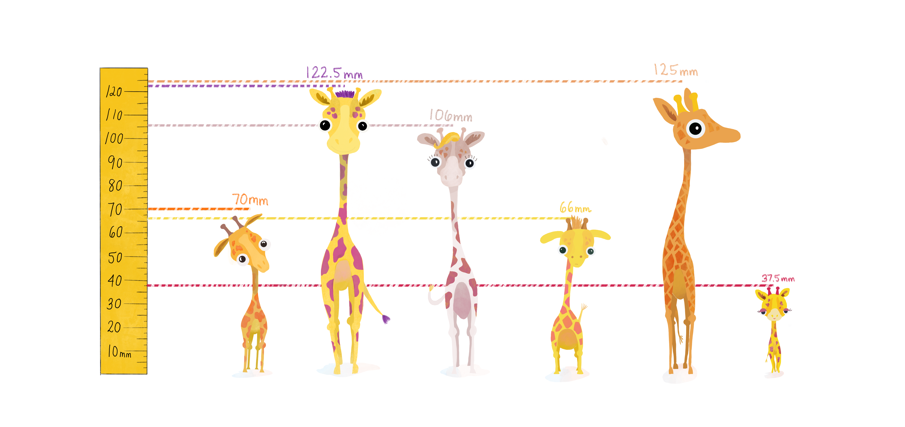

<style>
p.comment {
background-color: #DBDBDB;
padding: 10px;
border: 1px solid black;
margin-left: 25px;
border-radius: 5px;
}
</style>
<div class="alert alert-info">
  **Module learning objectives:**
  <br>1. 
  <br>2. Write your own function for calculating variance
</div>

<!-- <link href="styles.css" rel="stylesheet">  -->
<!--         <div class="image-descript"> -->
<!-- 					 -->
<!-- 					<div class="color-overlay"></div> -->
<!-- 					<div class="image-text"> -->
<!-- 						<div class="lil-image-text">Tiny Giraffes</div> -->
<!-- 						<div class="big-image-text"><strong>Big Questions</strong></div> -->
<!-- 					</div> -->
<!-- 				</div> -->


```{r setup, include=FALSE}
knitr::opts_chunk$set(echo = TRUE)
```


# Back on the island...
After successfully calculating the mean, you return to the memory of the first day you had collected your data...There was one that was your favorite-- it was especially cute! 

-After a few days, you get acquainted with this very small one. the favorite- how rare is its smallness?

...You return back to the data and you wonder-- how do you formally assess how spread out the values of height are among these small animals?


You might start by calculating the range. This gives us a rough idea of the kinds of heights we can expect on a very basic level. But, the range seems to ignore important information (i.e. outliers).

(Include Interactive plot where you see two different data sets with same range. One has outliers influencing the range-- while the other just has a lot more variability.)

The range is not good enough to capture the real difference.

What is a more stable measurment?

The answer is by calculating the variance.
<div style="margin-top:50px"></div>
<center>{width=800px}</center>
<div style="margin-bottom:50px"></div>

##Why is variance important?
You need a solid understanding of variance in order to grasp the mechanics of any statistical test.

<div style="margin-top:50px"></div>
<center>{width=800px}</center>
<div style="margin-bottom:50px"></div>

##How to calculate variance?
First, the idea is to capture how far away individual observations lie from the known mean. In other words, we could subtract the mean from each height.

Using \@ref(eq:equation2), it's easy to translate this into code in R.

```{r, include=FALSE}
tutorial::go_interactive(height = 400)
```


```{r ex="variance", type="sample-code"}

heights1 <- c(1,5,6,4,7,4,9,2)

# Subtract the mean from each height in the vector "heights1"


# Print out "heights1_diff"


```
```{r ex="variance", type="solution"}
heights1 <- c(1,5,6,4,7,4,9,2)

# Subtract the mean from each height in the vector "heights1"
heights1_diff <- heights1 - mean(heights1)

# Print out "heights1_diff"
heights1_diff
```
```{r ex="variance", type="sct"}
test_object("heights1_diff")

test_output_contains("heights1_diff", incorrect_msg= "Did you print 'heights1_diff'?")
success_msg("Great!")
```
<div style="margin-top:50px"></div>

This is a great start, but we're back to the problem of needing to summarize multiple values. Since these newly calculated values are both negative and positive, we quickly realize that adding them up (like the first step when calculating the mean) would not be a productive idea since the negatives cancel the positives.

What's the easiest thing to do when you want to retain how far away a point is from the mean irrespective of whether it's above or below the mean? How about taking the absolute value?

(Great explanation for why not to take the abs val)

Instead, we square the difference. Now, we have positive values that we can sum up. We call the number we get, the sum of squares. 

<div style="margin-bottom:50px">
</div>
\begin{equation}
 (\#eq:equation1)
 \Large {\sum_{i=1}^n (x_i - \bar{x})^2}
 \end{equation}
<div style="margin-bottom:50px">
</div>

The sum of squares is an important calculation that we will see again for other statistical operations. 

(Image of squares shown in a physical/concrete way)

We need to take into account how many observations contributed to these sum of squares. So, we divide by our n, we take the average of the squared differences from the mean. This is the variance.


<div style="margin-bottom:50px">
</div>
\begin{equation}
 (\#eq:equation2)
 \Large \sigma^2 = \frac{\sum_{i=1}^n (x_i - \bar{x})^2}{n}
 \end{equation}
<div style="margin-bottom:50px">
</div>


The problem with variance is that it is a scaleable number, and knowing the variance alone is not enough to gauge whether the spread is large or small without knowing the units of the data. So, the standard deviation fixes that. By taking the square root of the variance, we can "standardize" the sum of squares. The revised equation is below:


<div style="margin-bottom:50px">
</div>
\begin{equation}
 (\#eq:equation3)
 \Large \sigma = \sqrt{\frac{\sum_{i=1}^n (x_i - \bar{x})^2}{n}}
 \end{equation}
<div style="margin-bottom:50px">


Bell curve - place holder
 point out outliers in illustration
 
Population vs sample (N vs N-1)


</div>

Notes: 
- Things to think about: 
- Show how the Sum of Square for a non-normal distribution is not balanced on either side of the mean
- Maybe have scale illo showing sum of squares being unbalanced/ unequal


