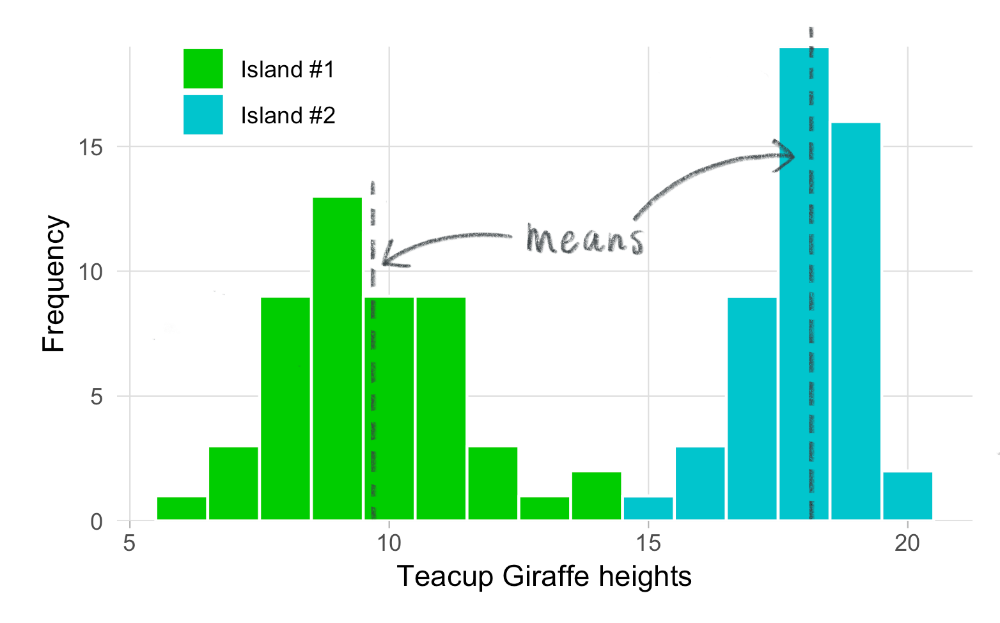
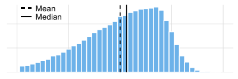
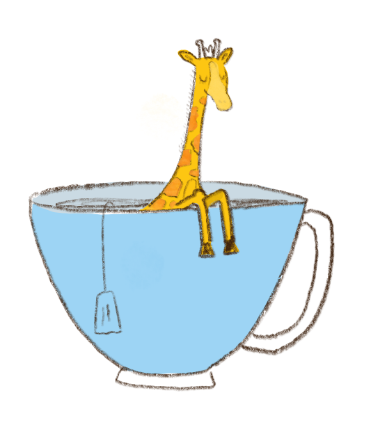

<style>
.main-container {max-width: 700px;}
</style>
# What are measures of centrality?

<div style="margin-top:50px"></div>
<p style=><center>
```{r, echo=FALSE}
library(ggplot2)
set.seed(12)
x <- rnorm(50, 10, 2)
x2 <- rnorm(50, 18, 1.2)
x <- data.frame(x=x, type="Island #1")
x2 <- data.frame(x=x2, type="Island #2")

d <- rbind(x,x2)

#p <- ggplot(data=d, aes(d$x, fill=d$type))+geom_histogram(binwidth=1, color="white")+theme_light()+scale_fill_manual(values=c("green3", "turquoise3"))+labs(x="Teacup Giraffe heights", y="Frequency", fill=NULL)+scale_y_continuous(expand=c(0,0))+theme(panel.border=element_blank(), panel.grid.minor=element_blank(), axis.ticks.y=element_blank(), legend.position= c(0.165,0.92), legend.background = element_blank())

#ggsave(filename = "/Users/Desiree/Documents/New R Projects/Cars/p.png", width=5, height=3, p)

```
{width=500px}

</center>
<div style="margin-bottom:25px"></div>

You've just collected a lot of height data and graphed it. Although informative, a graphical display of these data is difficult to summarize-- we need to describe these heights with a single number that will be meaningful and allow us to do statistics.

We can do this with a measure of centrality: the mean, the median, or the mode. A measure of centrality describes the concept that one number in the "center" of the data set is a good summary of the entire set. What's the best measure of the center? 

* The **mean** is the average and the measure of centrality that you are probably most familiar with. We describe it in detail below.

* The **median** is the number in the middle of the data set. Half of the observations lie above the median and half below. The median is used as the measure of centrality when your data are not normally distributed and are instead skewed to the left of right.
 <center>
 <div style="margin-bottom:20px"></div>
```{r, fig.show='animate', animation.hook = 'gifski', fig.width=6, fig.height=2, echo=FALSE, message=FALSE, warning=FALSE, results = 'hide', interval=0.5}
# library(fGarch)
# library(ggplot2)
# library(gifski)
# skew <- seq(0.5, 1, 0.05)
# skew2 <- seq(1.1, 2, 0.1)
# skew3 <- seq(1.9, 1, -0.1)
# skew4 <- seq(0.95, 0.55, -0.05)
# skew <- c(skew, skew2, skew3, skew4)
# plot <- function(x){
# 	d <- lapply(1:40, function(x){
# 		d <- data.frame(x=rsnorm(100000, mean=0, sd=2, xi=skew[x]), frame=x)
# 		return(d)
# 	})
# medians <- c(seq(0.31,-0.31, -0.031), seq(-0.279,0.279, 0.031))
# #medians <<- lapply(1:40, function(x) median(d[[x]]$x))
# p <- lapply(1:40, function(y) ggplot(data=d[[y]], aes(x))+geom_histogram(binwidth=0.25, color="white", fill="skyblue2")+theme_light()+theme(panel.border=element_blank(),panel.grid.minor=element_blank(), axis.ticks=element_blank(), axis.text=element_blank())+guides(fill=FALSE)+labs(x=NULL, y=NULL)+scale_y_continuous(expand=c(0,0),limits=c(0,5600), breaks=c(0,2000, 4000))+geom_vline(xintercept=0, size=0.5, linetype="dashed")+geom_vline(xintercept=medians[y], size=0.5)+xlim(-5,5)+annotate("text", label="Mean", size=3.4, x=-4.1, y=5300, hjust=0)+annotate("text", label="Median", size=3.4 ,x=-4.1, y=4600, hjust=0)+geom_segment(aes(x=-4.8, xend=-4.3, y=5300, yend=5300), linetype="dashed")+geom_segment(aes(x=-4.8, xend=-4.3, y=4600, yend=4600)))
# print (p)
# }

gif_file <-  file.path(getwd(), 'median.gif')
save_gif(plot(), gif_file= gif_file, progress = FALSE, loop= TRUE, delay= 0.5, width=400, height= 133, res= 100)

utils::browseURL(gif_file)

```
<center>  </center>
<div style="margin-bottom:20px"></div>
</center>

* The **mode** is the number (or height in our case) that occurs most frequently in the data set. It's not typically used in statistics, and we won't cover it further here.

<div style="margin-bottom:50px"></div>


### Taking the mean
The mean is the sum of all of the heights divided by the number of giraffes for the sample. All giraffes will be labeled "x", and the numerical subscript indicates the giraffes's number in the sample.

<p>We'll use ${\bar{x}}$ (read "x-bar") to represent the mean of each sample, calculated with the following equation:</p>
<div style="margin-bottom:50px"></div>
\begin{equation}
 (\#eq:equation1)
 \Large{\bar{x}} = \frac{x_1 + x_2 + ... + x_n}{n}
 \end{equation}
<div style="margin-bottom:50px">
</div>
To make this more efficient, instead of writing "${x_1 + x_2 + ... + x_n}$", we can use the uppercase sigma symbol $\sum{}$ to represent summation of all the observations. 

<div style="margin-bottom:50px"></div>
\begin{equation}
 (\#eq:equation2)
 \Large{\bar{x}} = \frac{\sum_{i=1}^{n}{x_i}}{n}
 \end{equation}
<div style="margin-bottom:50px">
</div>

<p> This might look intimidating, but equation \@ref(eq:equation2) is really showing the same thing as \@ref(eq:equation1). Let's break the symbols apart a bit (see annotated equation \@ref(eq:equation3) below). The sigma means 'add up'. What are we adding up? All the heights "x", which we call our *observations*. The "i&nbsp;=&nbsp;" part indicates which term to begin adding. For our purposes, this will always be the first observation, when i = 1. The character on top of the sigma is the last observation we include in our summation. In this case it's n --because we're adding all n = 50 observations in each group of giraffes. In both equations, we still divide by the total number of observations in each group we have: n. </p>

<div style="margin-bottom:50px">
</div>

<p>
<center>
\begin{equation}
 (\#eq:equation3)
\vcenter{\img[width=400px]{eq_annotated.png}}
 \end{equation}
</center>
</p>

<div style="margin-bottom:50px">
</div>

###Code it up
Using \@ref(eq:equation2), it's easy to translate this into code in R. The heights recorded from island 1 have been stored in a vector called `heights_island1`. Below we show the first few observations from this vector, using the `head()` function.
<div style="margin-bottom:15px">
</div>
```{r, echo=FALSE}
set.seed(12)
heights_island1 <- rnorm(50,10,2)
```

```{r, echo=TRUE}
head(heights_island1)
```

<div style="margin-bottom:15px">
</div>

Use the interactive window below to calculate the mean "by hand".

<div style="margin-bottom:15px"></div>
```{r, include=FALSE}
tutorial::go_interactive(height = 160)
```

```{r ex="mean", type="pre-exercise-code"}
set.seed(12)
heights_island1 <- rnorm(50,10,2)

```

```{r ex="mean", type="sample-code"}

# Sum up all heights stored in heights, using the sum() function, and save it as a new object called "heights_island1_sum"


# Divide heightsisland1_sum by the number of observations. Use the length() function for n. Store your answer as "heights_island1_mean"


# Print out "heights_island1_mean" and compare your answer to the R function "mean(heights_island1)"

```

```{r ex="mean", type="solution"}

# Sum up all heights stored in "heights_island1", using the sum() function, and save it as a new object called "heights_island1_sum"
heights_island1_sum <- sum(heights_island1)

# Divide heights_island1_sum by the number of observations. Use the length() function for n. Store your answer as "heights1_mean"
heights_island1_mean <- heights_island1_sum/length(heights_island1)

# Print out "heights_island1_mean" and compare your answer to the R function "mean(heights_island1)"
heights_island1_mean
mean(heights_island1)
```

```{r ex="mean", type="sct"}
test_object("heights_island1_sum")
test_object("heights_island1_mean")

test_output_contains("heights_island1_mean", incorrect_msg = "Did you print 'heights_island1_mean'?")
test_function("mean", incorrect_msg= "Did you run 'mean(heights_island1)'?")
success_msg("Great!")
```

<div style="margin-bottom:50px">
</div>


###Create your own function
 Now it's your turn to write your own function. Call it "my_mean" and have it calculate the mean of any given vector. You're going to use the rules for writing a function in R that you've used previously. As a reminder, you'll use `function()` and embed your code (that you completed in the previous exercise) within curly brackets`{}`. The advantage of making a "homemade" function is that you can string together all the steps from the previous exercise into a single command.
<div style="margin-bottom:15px">
</div>
```{r ex="mean_function", type="pre-exercise-code"}
set.seed(12)
heights_island1 <- rnorm(50,10,2)
```

```{r ex="mean_function", type="sample-code"}
# Complete the code below to create your own function that will calculate the mean of any vector

my_mean <- function(vector){
 
  
}

#Verify that your function correctly calculates the mean.
my_mean(heights_island1)
mean(heights_island1) 

```

```{r ex="mean_function", type="solution"}
# Complete the code below to create your own function that will calculate the mean of any vector

my_mean <- function(vector){
  a <- sum(vector)
  b <- a/length(vector)
  return(b)
}

#Verify that your function correctly calculates the mean.
my_mean(heights_island1)
mean(heights_island1) 

```

```{r ex="mean_function", type="sct"}
test_function_result(name= "my_mean", not_called_msg="Did you run my_mean()?", error_msg="There's an error in your function.", incorrect_msg="Your function runs, but it is calculating the wrong value.")
success_msg("Great!")
```
<div style="margin-bottom:15px">
</div>
 You can also complete the exercise above in RStudio on your local computer. This way you will be able to save your `my_mean()` function and script for future use.
 
 <div style="margin-bottom:50px"></div>


### Take a tea break!
<center> {width=300px} </center>


### Taking the median
To calculate the median go through the following steps:

* Assess whether there is an odd or even number of observations
* Order all observations from smallest to largest
* If an odd number, then the median is the middle value at position: (n + 1) / 2
* If an even number, then:
    + Find the value at the position: n / 2
    + Find the value at the position: (n / 2) + 1
    + The median will be the mean of the values of at these two positions.
  
Before you write your own median function, the two concepts need to be introduced: 1) the modulus operator `%%` and 2) `if...else` statements. 

The modulus operation gives the remainder after division of one number by another. For example, in R `11 %% 5` returns the `1`, which is the remainer of `11` divided by `5`.  If the modulus operation returns `0`, then there is no remainder. It is useful to apply the modulus operation `x %% 2` to determine whether a number `x` is even or odd by testing whether or not the result is exactly equal to 0. See example code below.
<div style="margin-bottom:15px">

<style>
  .col2 {
    columns: 2 200px;         /* number of columns and width in pixels*/
    -webkit-columns: 2 200px; /* chrome, safari */
    -moz-columns: 2 200px;    /* firefox */
  }
  .col3 {
    columns: 3 100px;
    -webkit-columns: 3 100px;
    -moz-columns: 3 100px;
  }
</style>

</div>
<div class="col2">
```{r, tut=FALSE, prompt=TRUE}
10 %% 2
10 %% 2 == 0
11 %% 2
11 %% 2 == 0
```
</div>
<div style="margin-bottom:15px">
</div>
The `if...else` statements are useful when you want to specify distinct outcomes for objects dependent on whether they meet your set criteria. See below.
<div style="margin-bottom:15px">
</div>
```{r ex="if_else", type="pre-exercise-code"}
set.seed(12)
heights_island1 <- rnorm(50,10,2)
```

```{r ex="if_else", type="sample-code"}
# Print a different result dependent on whether a number is even or odd

if(length(heights_island1) %% 2 == 0) {
  print("EVEN!")
} else {
    print("ODD!")
}


if((length(heights_island1)-1) %% 2 == 0) {
  print("EVEN!")
} else {
    print("ODD!")
}
```
<div style="margin-bottom:15px">
</div>

Now that you have a sense for how the `%%` operator can be used to test whether a number is EVEN  or ODD, and how `if...else` statements work, use both of these concepts in the window below to write your own function that calculates the median of any vector. 

<div style="margin-bottom:15px">
</div>
```{r, include=FALSE}
tutorial::go_interactive(height = 210)
```

```{r ex="median_function", type="pre-exercise-code"}
set.seed(12)
heights_island1 <- rnorm(50,10,2)
```

```{r ex="median_function", type="sample-code"}
# Complete the code below to create your own function that will calculate the median of any vector

my_median <- function(vector){
  if(){
   
  }else{ 
   
  }
}

#Verify that your function correctly calculates the median.
my_median(heights_island1)
median(heights_island1) 

```

```{r ex="median_function", type="solution"}
# Complete the code below to create your own function that will calculate the median of any vector

my_median <- function(vector){
  ordered_heights <- sort(vector, decreasing = FALSE)
  if(length(ordered_heights) %% 2 == 0){
   position1 <- length(ordered_heights) / 2
   position2 <- position1 + 1
   temp_values <- ordered_heights[c(position1, position2)]
   median <- mean(temp_values)
  }else{ 
   position <- (length(ordered_heights) + 1) / 2
   median <- ordered_heights[position]
  }
  return(median)
}

#Verify that your function correctly calculates the median.
my_median(heights_island1)
median(heights_island1) 


```

```{r ex="median_function", type="sct"}
test_function_result(name= "my_median", not_called_msg="Did you run my_mean()?", error_msg="There's an error in your function.", incorrect_msg="Your function runs, but it is calculating the wrong value.")
success_msg("Great!")
```
<div style="margin-bottom:50px">
</div>

###Things to think about...
Remember that the sample mean is the estimate the entire population's mean (which would be impossibly large to measure). How reliably does the mean of a sample represent the population mean? {RED} Warning: if a small sample has been used, the sample mean may not be a reliable at all! Estimates from small samples are subject to the whims of randomness: the larger the sample, the closer the sample size appraches the population size, and the more reliable the sample estimate becomes.

Pressing 'Play' on the plot below will illustrate this concept. 

* This animation shows the values of means calculated from increasingly larger samples. 
* Each point in this line is the mean calculated from a random sample. The TRUE mean of the population is 0.
* The x-axis shows the sample size: small samples on the left, and larger samples to the right. 
* The y-axis shows what the mean is for a sample of that particular size. Though the y-values vary here, remember that if the sample were a GOOD estimate of the population, the y-values should be very close to 0.  
* But you can see that when the samples are small the sample mean isn't always a good representation of the population that it was sampled from--and that's not a good thing.

For further reading see the [Law of Large Numbers](https://en.wikipedia.org/wiki/Law_of_large_numbers).


```{r, tut=FALSE, echo=FALSE, message= FALSE}
library(emdbook)
library(plotly)

m <- list(
  l = 50,
  r = 50,
  b = 10,
  t = 10,
  pad = 4
)

accumulate_by <- function(dat, var) {
  var <- lazyeval::f_eval(var, dat)
  lvls <- plotly:::getLevels(var)
  dats <- lapply(seq_along(lvls), function(x) {
    cbind(dat[var %in% lvls[seq(1, x)], ], frame = lvls[[x]])
  })
  dplyr::bind_rows(dats)
}

d <- do.call(rbind, lapply(lseq(10,10000, 300), function(x){
	d <- data.frame(x=rnorm(x), frame=x/300, N=x)
	return(d)
}))

dd <- aggregate(data=d, x~frame+N, FUN=mean)%>%
accumulate_by(~N)
p <- dd %>% plot_ly(x=~log10(N), y=~x, frame=~frame, type="scatter", mode="lines", line = list(simplyfy = F, color="orangered"),width=550, height=350)%>% 
 animation_opts(
    frame = 10, 
    transition = 0, 
    redraw = FALSE
 ) %>% 
config(displayModeBar = F) %>%
  layout(
    xaxis = list(
      title = "Sample Size (log10)",
      zeroline = F
    ),
    yaxis = list(range=c(-0.7,0.7),
      title = "Mean",
      zeroline = F
    ), autosize=F, margin=m
  ) %>%
  animation_slider(
    hide = T
    )%>%
  animation_button(
    x = 1, xanchor = "right", y = 0, yanchor = "bottom"
  )

htmltools::save_html(p,"Law_of_large_numbers.html")

```
<center><iframe style="margin: 0px;" src="Law_of_large_numbers.html" width="570" height="400" scrolling="yes" seamless="seamless" frameBorder="0"> </iframe></center>

<hr />
<p style="text-align: center;"> <span style="color: #808080;"> Created using </span></p>
<p><center>{width=40px}
{width=40px}
{width=40px}</p>

 <script type="text/x-mathjax-config">
    MathJax.Ajax.config.path["img"] = "https://cdn.rawgit.com/pkra/mathjax-img/1.0.0/";
    MathJax.Hub.Config({
    extensions: ["tex2jax.js","[img]/img.js"],
    jax: ["input/TeX","output/HTML-CSS"],
    tex2jax: {inlineMath: [["$","$"],["\\(","\\)"]]},
    });
 </script>
